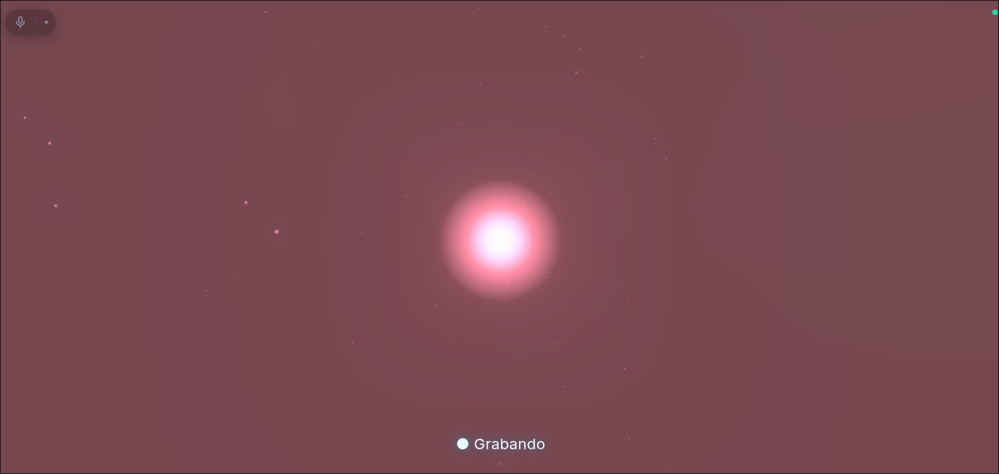
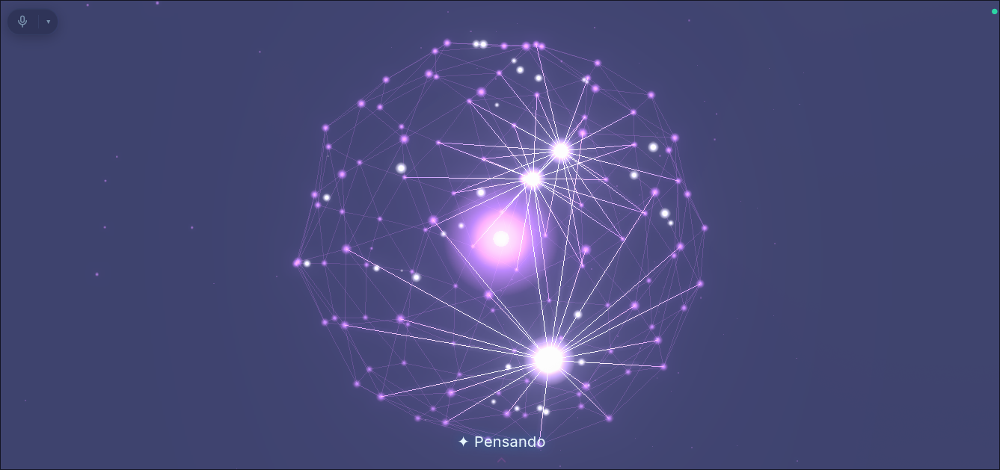
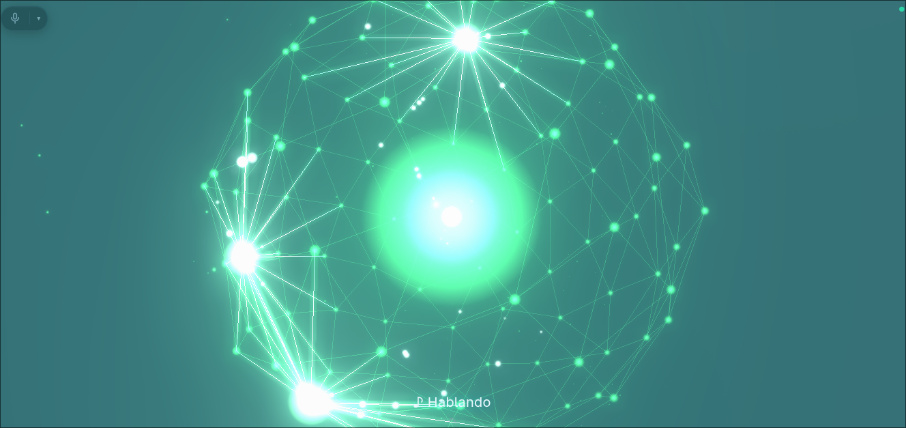

# saga

Asistente de voz para Linux/Hyprland: **voz → Claude Code → voz**, sobre **LiveKit**
(runtime de audio) + **Deepgram** (STT/TTS), con un orbe 3D que reacciona al estado.
Dos modos de turno: **push-to-talk** (Win+Z por turno, default) y **llamada** (la línea queda
abierta y el fin de cada turno lo decide Deepgram Flux).

> Proyecto personal, **en desarrollo activo**. Lo uso todos los días en mi máquina y lo publico
> para mostrar en qué trabajo por fuera del laburo. No es un producto: no hay instalador, la
> configuración asume Arch + Hyprland, y las decisiones están tomadas para mi setup. El código y
> la documentación sí están escritos para que se entiendan y se puedan correr.

Corre en **modo room** (único, estándar): un server LiveKit local (binario nativo) + el browser
como cliente (orbe) que publica el mic y reproduce el TTS + un worker (el cerebro). Con
`DEEPGRAM_API_KEY` el STT/TTS es Deepgram; sin key cae al fallback local (whisper + edge-tts),
dentro del agente.

## El orbe

No hay ventana, ni botones, ni historial: **el orbe es toda la interfaz**. Three.js con bloom,
corriendo en el browser, que además es el cliente LiveKit que publica el mic y reproduce el TTS.

Cada estado del turno tiene su color, su velocidad y su energía —definidos en un solo lugar,
el objeto `PH` de [`orb/orb.html`](orb/orb.html)— y las transiciones se interpolan en vez de
saltar. Mientras habla, el orbe **late con el nivel real del audio del TTS** (Web Audio), no con
una animación de relleno.

| | |
|:--:|:--:|
|  |  |
| **`idle`** · en espera, cian sereno | **`rec`** · te está escuchando |
|  |  |
| **`think`** · Claude Code resolviendo el turno | **`speak`** · la red late con la voz |

Hay más estados que los cuatro de arriba: `listen` (línea abierta en modo llamada),
`transcribe`, `screen` (mirando pantalla), y transitorios como `nueva`, `error`, `cancel` y
`attach`, que se muestran un ratito y vuelven solos al estado de base.

## Flujo

```
Win+Z → browser publica el mic → server LiveKit local (WebRTC)
        → worker: LiveKit (streaming, VAD, barge-in)
        → STT: Deepgram Flux (llamada) o Nova-3 (push-to-talk)
        → Claude Code (daemon caliente, el cerebro: responde y hace cosas en la compu)
        → Deepgram Aura-2 (TTS, voz es. gloria)
        → browser reproduce el TTS y el orbe late con la voz real (Web Audio)
```

**LiveKit es dueño de todo el runtime de audio** (captura, chunks, streaming, barge-in).
Nosotros enchufamos las piezas: STT, cerebro y TTS. El cerebro es **Claude Code** (no una API
plana) → puede ejecutar bash, leer archivos, usar MCP: hace cosas en la máquina, no solo conversa.

**Quién cierra el turno depende del modo**: en push-to-talk lo cierra el silencio (VAD silero,
piso fijo); en llamada lo decide **Flux**, con señales acústicas Y lingüísticas.

### Latencias medidas (con Deepgram, cerebro Claude, 329 turnos de log real)

| Situación | ttft del LLM |
|---|---|
| turno normal, proceso caliente | **~1.7s** (mediana) |
| turno que usa tools | ~3.7s |
| turno después de una interrupción | ~6.0s ⚠️ |

EOU (Flux) ~0.5–0.9s · TTS ttfb ~0.3s. De "callaste" a "te habla": **~2.5s** en el caso normal.

> ⚠️ El salto tras una interrupción es un **defecto conocido**: al cortarla, el daemon mata el
> proceso `claude` y el turno siguiente paga un `--resume` en frío. Medido: 2.5s de arranque de
> proceso + 1.4s de recarga de la sesión. Ver [deuda técnica](docs/tech-debt-plan.md).

## Documentación

Documentación para mantenedores en [`docs/`](docs/): [arquitectura](docs/architecture.md) ·
[flujo de un turno](docs/turn-flow.md) · [API interna](docs/internal-api.md) ·
[guía del código](docs/code-guide.md) · [operación](docs/operations.md) ·
[deuda técnica + plan](docs/tech-debt-plan.md). Empezá por [`docs/README.md`](docs/README.md).

## Requisitos

- Python 3.12 + venv del proyecto (`.venv/`).
- **`livekit-server`** (binario nativo) en `~/.local/bin/` — el modo room corre un server
  LiveKit local (no Docker; el NAT de Docker rompe el WebRTC sobre localhost).
- **`DEEPGRAM_API_KEY`** + **`LIVEKIT_API_KEY`/`LIVEKIT_API_SECRET`** en `.env.local`
  (gitignored). Sin la key de Deepgram, cae a fallback local (faster-whisper + edge-tts).
- Binarios: `claude` (CLI), `mpg123`, `grim` (screenshot), `hyprctl`/`kitty`/`xdg-open`,
  y un browser (el cliente del orbe).
- Hotkey: bind de Hyprland a `~/.local/bin/saga` (Win+Z).

## Setup (desde cero)

**1. Binarios del sistema** (Arch):
```bash
sudo pacman -S mpg123 grim kitty        # reproducción / screenshot / monitor
# claude CLI:  https://github.com/anthropics/claude-code   (npm i -g @anthropic-ai/claude-code)
# uv (opcional, recomendado):  https://docs.astral.sh/uv/
```

**2. Crear el venv e instalar el proyecto** (genera los comandos `saga` y `saga-ctl` en `.venv/bin/`):
```bash
python -m venv .venv                                  # o: uv venv
.venv/bin/python -m pip install -e .                  # o: uv pip install --python .venv/bin/python -e .
```

**3. El server LiveKit nativo** (binario, NO Docker — el NAT de Docker rompe el WebRTC local):
```bash
# Release oficial de livekit/livekit a ~/.local/bin/livekit-server.
# El instalador oficial baja el binario para tu plataforma:
curl -sSL https://get.livekit.io | bash                # deja livekit-server en el PATH
# Movelo/symlinkealo a ~/.local/bin/ si no quedó ahí (es donde lo busca saga-ctl):
#   install -Dm755 "$(command -v livekit-server)" ~/.local/bin/livekit-server
```
> La config vive en `livekit.yaml` (versionada, sin secretos): signaling en loopback
> (`:7880`), media UDP en `:7882`. `saga-ctl` auto-detecta la IP de LAN (`NODE_IP`, vía
> `ip route`) e inyecta las keys por env al arrancar — el yaml no las contiene.

**4. Las keys** (gitignored, NO se commitean) en `.env.local`:
```bash
# Deepgram (cuenta free en deepgram.com):
echo 'DEEPGRAM_API_KEY=tu_key' >> .env.local
# LiveKit: generá un par api-key / api-secret con el propio binario:
livekit-server generate-keys                           # imprime un KEY y un SECRET
cat >> .env.local <<'EOF'
LIVEKIT_URL=ws://127.0.0.1:7880
LIVEKIT_ROOM=saga
LIVEKIT_API_KEY=APIxxxxxxxx
LIVEKIT_API_SECRET=secretoxxxxxxxx
EOF
```
Sin la key de Deepgram, cae a fallback local (faster-whisper + edge-tts, más lento).
Las keys de LiveKit son necesarias: sin ellas el server no arranca.

**5. Comandos globales** (wrappers en `~/.local/bin`, para no activar el venv a mano).
El keybind de Hyprland los necesita por ruta absoluta:
```bash
cat > ~/.local/bin/saga <<'EOF'
#!/usr/bin/env bash
export PATH="$HOME/.local/bin:/usr/local/bin:/usr/bin"
exec "$HOME/.local/share/saga/.venv/bin/python" "$HOME/.local/share/saga/saga.py" "$@"
EOF
cat > ~/.local/bin/saga-ctl <<'EOF'
#!/usr/bin/env bash
exec "$HOME/.local/share/saga/.venv/bin/python" "$HOME/.local/share/saga/vcctl.py" "$@"
EOF
chmod +x ~/.local/bin/saga ~/.local/bin/saga-ctl
```

**6. Keybind de Hyprland** (Win+Z = push-to-talk). En `~/.config/hypr/.../Keybinds.conf`:
```
bindd = $mainMod, Z, Saga (toggle), exec, /home/TU_USUARIO/.local/bin/saga
```
Después `hyprctl reload`.

> Wake word "hey saga": OFF por default (`SAGA_WAKE_ENABLED=1` para activar; corre en el server sobre el track del mic, U4). El trigger normal es Win+Z.

## Correr

```bash
saga-ctl start      # levanta TODO: server nativo + Claude + orbe + worker + browser
saga-ctl status     # ver modo, stack (Deepgram vs fallback) y procesos (server/worker/daemon/orbe)
saga-ctl stop       # apagar todo (incluido el binario del server)
```

`saga-ctl start` arranca las piezas en orden con readiness por pieza: el server LiveKit
nativo (fresco), el cerebro (`claude_daemon`), el orbe (`orb_server`), el worker (`lk/agent.py
start`, fresco), y abre el browser cliente. El worker se despacha SOLO (dispatch automático) cuando
el browser se une al room; saga-ctl espera a que el socket de control del agente responda.

### Uso — modo push-to-talk (default, 3 fases)
- **idle → Win+Z**: empieza a grabar (orbe "Grabando").
- **grabando → Win+Z**: corta y manda el turno (o esperá ~1.2s de silencio, manda solo).
- **procesando/hablando → Win+Z**: mata la respuesta en curso (orbe "Cancelado").

### Uso — modo llamada (`SAGA_MODE=call`)
```bash
SAGA_MODE=call saga-ctl start
```
- **Win+Z**: levanta el tubo. La línea **queda abierta** (orbe "◉ En línea").
- Hablás cuando querés: el fin de cada turno lo corta **Flux**, no un umbral de silencio.
- **Win+Z de nuevo**: colgás. También cuelga sola tras `SAGA_CALL_IDLE_TIMEOUT_S` (180s) sin
  actividad — un mic abierto indefinidamente frente a una IA agéntica es una superficie que no
  queremos dejar viva sin que nadie la use.
- **Barge-in**: le hablás encima y se calla. Hace falta decir al menos
  `SAGA_INTERRUPT_MIN_WORDS` palabras (2) para que cuente como interrupción.

> El modo **no es pegajoso**: sale del env de la shell. Un `saga-ctl restart` sin
> `SAGA_MODE=call` te devuelve a push-to-talk + Nova-3, y solo se nota mirando el log.

### En los dos modos
- **Visión on-demand**: decí "mirá la pantalla", "fijate esto", "qué ves" → captura con
  grim, se la manda a Claude, y la borra (privacidad).
- **Reset por voz**: "nueva sesión", "empezamos de cero", "olvidate de todo" → sesión limpia.
  Sin eso la conversación **persiste para siempre**, incluso entre reinicios de saga.
- **Control de micrófono** en el orbe (arriba a la izquierda): clic o tecla `M` para mutear,
  y un selector de dispositivo de entrada.

## Stack

| Pieza | Tecnología | Notas |
|-------|-----------|-------|
| Transporte | **server LiveKit nativo** (room, local) ↔ browser cliente ↔ worker | default; sin Docker |
| Runtime audio | **LiveKit Agents** (worker `lk/agent.py start`) | captura/stream/VAD/turn/barge-in |
| Fin de turno (llamada) | **Deepgram Flux** (`turn_detection="stt"`) | acústica + lingüística; `eager_eot` arranca a generar antes |
| Fin de turno (push-to-talk) | **Silero VAD** (`turn_detection="vad"`) | piso fijo `min_delay` 1.2s; U10 sacó el MultilingualModel (−1.8 GB RAM) |
| Interrupción | **Silero VAD** + filtros de LiveKit | `adaptive` NO se puede: necesita LiveKit Cloud |
| STT | **Deepgram Flux** (llamada) / **Nova-3** (push-to-talk) | fallback: faster-whisper local |
| Cerebro | **Claude Code** (`claude_daemon`, stream-json) | ejecuta tools/bash/MCP. `SAGA_LLM=gemini` lo cambia por un LLM en la nube (sin tools) |
| TTS | **Deepgram Aura-2** (voz `aura-2-gloria-es`) | fallback: edge-tts |
| Cliente / orbe | browser con LiveKit JS SDK + Three.js (`orb/orb.html`) | publica mic, late con la voz real (Web Audio) |

## Variables de entorno

El stack se decide **solo** (Deepgram si hay key, fallback si no) — NO hay flags para
elegir proveedor.

Secretos en `.env.local` (gitignored): `DEEPGRAM_API_KEY` · `LIVEKIT_API_KEY` ·
`LIVEKIT_API_SECRET`. También viven ahí `LIVEKIT_URL` (default `ws://127.0.0.1:7880`) y
`LIVEKIT_ROOM` (default `saga`).

Toggles:

| Var | Default | Qué hace |
|-----|---------|----------|
| `SAGA_MODE` | `ptt` | `=call` abre el modo llamada (línea abierta + Flux). Un valor inválido cae a `ptt` |
| `SAGA_LLM` | `claude` | `=gemini` cambia el cerebro por un LLM en la nube **sin tools**. Existe para medir cuánta latencia es el modelo y cuánta el harness |
| `SAGA_WAKE_ENABLED` | `0` (off) | `=1` activa el wake "hey saga" en el server (sobre el track del mic). **Ojo**: con wake ON el mic del browser queda desmuteado siempre |
| `CLAUDE_PLUGINS` | `0` (off) | `=1` carga los plugins de Claude en el daemon (MCP+skills+hooks+slash), menos los de `configs/plugins-blacklist.json`. Off = claude pelado: sin `--setting-sources`, sin skills, sin MCPs, sin CLAUDE.md (bajó el primer token de ~57s a ~7s) |
| `VOICE_CLAUDE_MEM` | `0` (off) | `=1` activa claude-mem en voz (+2-7s/turno; respawnear daemon) |
| `ORB_PORT` | `8777` | puerto del server del orbe |

**Modo llamada** (solo aplican con `SAGA_MODE=call`):

| Var | Default | Qué hace |
|-----|---------|----------|
| `SAGA_CALL_IDLE_TIMEOUT_S` | `180` | silencio que cuelga la llamada sola. No es el fin de turno: es "no hay nadie del otro lado" |
| `SAGA_FLUX_MODEL` | `flux-general-multi` | 10 idiomas con code-switching. `language_hint` sobre `flux-general-en` da **400** |
| `SAGA_FLUX_LANGUAGES` | `es,en` | hints de idioma (sesgan sin encerrar) |
| `SAGA_FLUX_EOT` | `0.7` | confianza para cerrar el turno (rango 0.5–0.9) |
| `SAGA_FLUX_EAGER_EOT` | `0.6` | arranca a generar ANTES de confirmar; si seguís hablando llega `TurnResumed` y se cancela. Más bajo = más rápido y más arranques en falso |
| `SAGA_FLUX_EOT_TIMEOUT_MS` | `3000` | techo duro de silencio antes de forzar el fin de turno |
| `SAGA_FLUX_KEYTERMS` | ver `vc/config.py` | jerga y nombres propios que ningún modelo tiene en su diccionario |
| `SAGA_FLUX_MIP` | `0` (opt-out) | `=1` participa del programa de mejora de modelos de Deepgram (tu audio se puede usar para entrenar). Por default **no** |

**Interrupción** (los dos modos):

| Var | Default | Qué hace |
|-----|---------|----------|
| `SAGA_INTERRUPT_MIN_WORDS` | `2` | palabras mínimas para que cuente como interrupción. El default de LiveKit es 0: una palabra suelta mal transcripta cortaba respuestas enteras |
| `SAGA_INTERRUPT_MIN_DURATION` | `0.5` | voz mínima (s) para registrar la interrupción |
| `SAGA_INTERRUPT_FALSE_TIMEOUT` | `1.5` | silencio tras una interrupción para declararla falsa y retomar donde iba |

El stack STT/TTS NO es un toggle: lo decide la presencia de `DEEPGRAM_API_KEY` (Deepgram) o su
ausencia (fallback faster-whisper + edge-tts, dentro del agente).

## Arquitectura

Modo room (único) — topología **server LiveKit ↔ browser cliente (orbe) ↔ worker**, todo local:

- **Server**: `livekit-server` nativo (`~/.local/bin/`), config `livekit.yaml`. Signaling en
  loopback (`:7880`), media UDP en `:7882`. `saga-ctl` auto-detecta `NODE_IP` (IP de LAN) e
  inyecta las keys (`LIVEKIT_KEYS`) por env. No Docker: el NAT rompe el WebRTC local.
- **Cliente** (`orb/orb.html`): browser con el LiveKit JS SDK (vendoreado en
  `orb/vendor/livekit/`). Pide el JWT a `/token`, se une al room, publica el mic, recibe el track
  TTS y lo reproduce; el orbe late con el nivel real de la voz (Web Audio `AnalyserNode`). Trae un
  control de micrófono (mute + selector de dispositivo).
- **Token + dispatch**: `orb/orb_server.py` `/token` mintea el JWT **y pide el dispatch por API**
  (`vc/dispatch.py`), justo cuando el cliente está por entrar. No es automático ni por token:
  - el **automático** despacha al *crearse* el room, y con la pestaña del orbe abierta el cliente
    reconectaba ~2s antes de que el worker terminara de registrarse → el agente no entraba nunca y
    Win+Z moría con `FileNotFoundError`. `saga-ctl restart` fallaba **siempre**;
  - el **por token** (`RoomConfiguration.agents`, lo que documenta LiveKit) pide un job
    `JT_PARTICIPANT`, y el SDK de Python solo registra workers `JT_ROOM`/`JT_PUBLISHER`. El server
    responde `not dispatching agent job since no worker is available`. Hay un test canario que se
    rompe el día que aparezca `ServerType.PARTICIPANT`, para volver al camino simple.

Paquete `lk/` (worker):

| Módulo | Responsabilidad |
|--------|-----------------|
| `lk/agent.py` | entrypoint: `lk/agent.py start` (worker room); arma `AgentSession`, las fases de Win+Z (3 en ptt, abrir/colgar en llamada), socket de control, wake-on-track |
| `lk/claude_llm.py` | LLM custom de LiveKit que delega en `claude_daemon` (+ visión grim) |
| `lk/speech.py` | **turno segmentado**: habla los bloques que vienen después del primero (`session.say()`) y maneja la concurrencia de turnos solapados |
| `lk/heard.py` | qué llegaste a **escuchar** de una respuesta cortada → se lo pasa a Claude como nota, porque su sesión guarda lo que generó, no lo que sonó |
| `lk/wakeword.py` | detector "hey saga" sobre el track del mic del browser (el `WakeWordListener` nativo solo lee portaudio) |
| `lk/whisper_stt.py` | STT de fallback (faster-whisper) si no hay Deepgram |
| `lk/edge_tts_plugin.py` | TTS de fallback (edge-tts) si no hay Deepgram |
| `lk/onnx_tune.py` | capea threads de ONNX antes de cargar silero/wake (mataba ~367% de CPU en idle) |

Soporte (paquete `vc/`, reusado): `config` (paths/secretos) · `claudecli` +
`claude_daemon.py` (cerebro caliente) · `orb` + `orb/orb_server.py` (orbe + `/token`) ·
`desktop` (grim/Hyprland) · `runtime` · `session`. (`wake_daemon.py`/Vosk queda dormido,
fuera de scope.)

Control: `vcctl.py` (`saga-ctl`) orquesta el arranque (`_start_room`: server fresco → daemon →
orbe → worker fresco → browser → wait del socket de control), abre el monitor y espera readiness por
pieza. El browser, al pedir el token, dispara el dispatch del worker por API (`vc/dispatch.py`).
Win+Z (`vc/app.py` → `_livekit_press`) le manda `press` al socket del agente.

### Estado de la conversación

**Claude Code es dueño del contexto, no LiveKit.** `lk/claude_llm.py` ignora el `chat_ctx` del
framework a propósito: la conversación multivuelta vive en la sesión del CLI, que se reanuda con
`--resume` (uuid en `session.json`). Eso es lo que da el cerebro agéntico — Claude recuerda qué
tools corrió, no solo lo que dijo — y es también el origen de tres cosas:

- `lk/heard.py` existe para tapar el hueco: LiveKit sabe hasta dónde sonó la voz, Claude no.
- La sesión **no expira**: crece hasta que pidas un reset por voz.
- Interrumpir mata el proceso → el turno siguiente paga el `--resume` en frío.

Ver [`docs/architecture.md`](docs/architecture.md) para el trade-off completo.

## Privacidad

En modo Deepgram, el audio del mic viaja a Deepgram en streaming (precio de la
velocidad). El server LiveKit es local y su signaling bindea solo a loopback (nadie
externo pide token ni se une). Las keys viven en `.env.local` (gitignored). Las capturas
de pantalla se borran inmediatamente tras mandarlas a Claude. Para todo-local (sin que el
audio salga a la nube): no pongas `DEEPGRAM_API_KEY` → STT/TTS corren con el fallback local.

## Desarrollo

Parte de saga se construyó con **[AI-DLC](https://github.com/awslabs/aidlc-workflows)** (AWS Labs),
un framework de ciclo de vida de desarrollo asistido por IA, corriéndolo con **Claude Code**: fases
de inception y construction, gates de aprobación por etapa y trazabilidad de decisiones. Las
bitácoras que genera son tooling de desarrollo local y no se versionan; lo que quedó de ese proceso
en el repo es la documentación de [`docs/`](docs/) y el propio diseño del código.

## Licencia

[MIT](LICENSE) © 2026 Renzo Piris.
