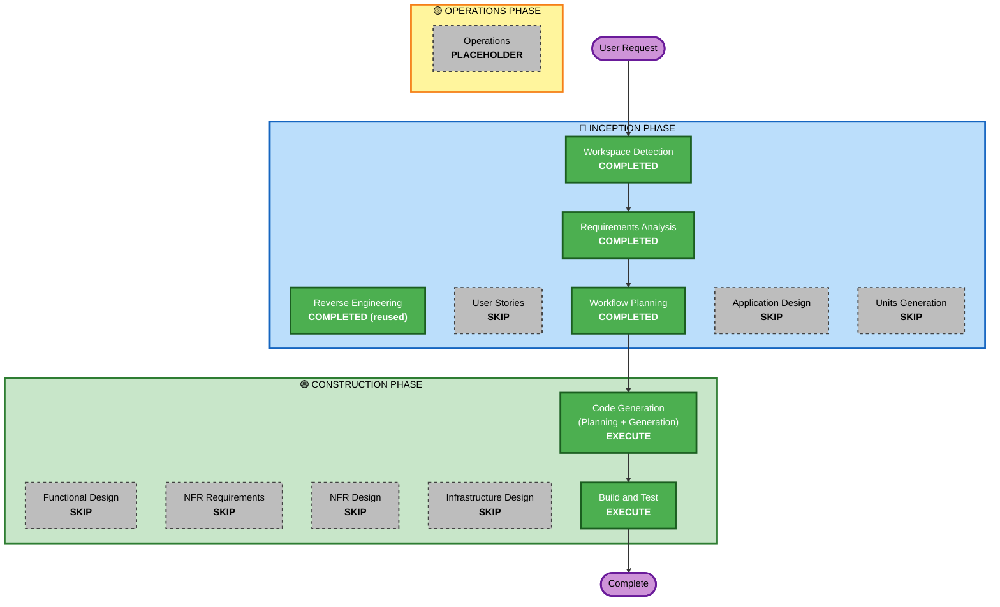

# Execution Plan — Ciclo 5 (saga agéntico: cargar plugins en Claude)

## Detailed Analysis Summary

### Transformation Scope (Brownfield)
- **Transformation Type**: Single component / configuration change.
- **Primary Changes**: toggle env reversible en `vc/config.py` que conmuta `CLAUDE_FAST_FLAGS`
  (stripped ↔ con-plugins) + propagación del env al arranque del `claude_daemon` vía `saga-ctl`.
- **Related Components**: `claude_daemon.py` (arranque del CLI), `vcctl.py`/`saga-ctl` (pasar el env),
  `vc/guard.py` (guard ya existente, sin cambios salvo evaluación del gap no-Bash).

### Change Impact Assessment
- **User-facing changes**: Indirecto — saga gana acceso a tools/MCPs pero paga latencia/estabilidad. Medido, no asumido.
- **Structural changes**: No.
- **Data model changes**: No.
- **API changes**: No.
- **NFR impact**: Sí — latencia (TTFT + boot del daemon) y seguridad (god-mode + tools externas). Gate duro.

### Component Relationships
- **Primary Component**: `vc/config.py` (`CLAUDE_FAST_FLAGS` / `build_claude_base_args`).
- **Dependent Components**: `claude_daemon.py` (consume los args), `vcctl.py` (lanza el daemon con el entorno).
- **Supporting Components**: `vc/guard.py` (PreToolUse Bash hook = el safety-net que el usuario borró, ya nativo).
- **Change Type**: Configuration-only en config; Minor en vcctl (propagar env si hace falta).

### Risk Assessment
- **Risk Level**: Low (código) / Medium (experimento en vivo: posible boot storm de MCPs pesados).
- **Rollback Complexity**: Easy — default OFF; revertir = no setear el env. El arranque por defecto no cambia.
- **Testing Complexity**: Moderate — la verificación real es en vivo (boot + TTFT + estabilidad), la corre el usuario.

## Workflow Visualization

## Phases to Execute

### 🔵 INCEPTION PHASE
- [x] Workspace Detection (COMPLETED — resume brownfield)
- [x] Reverse Engineering (COMPLETED — reusado de Ciclo 1)
- [x] Requirements Analysis (COMPLETED — ciclo5-agentic-requirements.md)
- [x] User Stories (SKIP)
  - **Rationale**: spike de configuración; sin user-facing nuevo, sin personas, sin acceptance criteria.
- [x] Workflow Planning (IN PROGRESS → este documento)
- [ ] Application Design (SKIP)
  - **Rationale**: sin componentes/servicios nuevos; se toca config existente.
- [ ] Units Generation (SKIP)
  - **Rationale**: entregable único (un toggle); sin descomposición.

### 🟢 CONSTRUCTION PHASE
- [ ] Functional Design (SKIP)
  - **Rationale**: sin modelos de datos ni lógica de negocio nueva.
- [ ] NFR Requirements (SKIP)
  - **Rationale**: extensiones opt-out; el gate latencia+estabilidad y la postura de seguridad ya
    están como constraints duros en requirements (NFR1/NFR2/NFR3).
- [ ] NFR Design (SKIP)
  - **Rationale**: NFR Requirements salteado; sin patrones NFR nuevos que diseñar.
- [ ] Infrastructure Design (SKIP)
  - **Rationale**: sin infra/cloud; todo local, env-driven.
- [ ] Code Generation (EXECUTE — always)
  - **Rationale**: implementar (a) el toggle env reversible (`VOICE_FULL_STACK` off/full) + granularidad
    **a nivel PLUGIN** (`VOICE_DISABLED_PLUGINS` → `enabledPlugins:false` vía `--settings`, per-saga,
    aislado del global); (b) un **harness de medición de atribución** (snapshot RSS/%CPU del árbol de
    procesos del daemon → cada MCP por cmdline + parse de TTFT del `saga.log`). Part 1 plan + Part 2 código.
- [ ] Build and Test (EXECUTE — always)
  - **Rationale**: verificación estática (py_compile + flags en ambos modos) + **medición en vivo
    del usuario** (boot, TTFT, estabilidad) usando el harness, con **atribución por pieza** cuando
    algo falle (MCPs por proceso · boot por `--debug` · skills por tokens · hooks por latencia/turno)
    = el gate go/no-go del spike.

### 🟡 OPERATIONS PHASE
- [ ] Operations (PLACEHOLDER)

## Package Change Sequence
Único módulo (`vc/` + daemon). Sin secuencia multi-paquete.

## Estimated Timeline
- **Total stages a ejecutar**: 2 (Code Generation + Build and Test). Ciclo corto, como pidió el usuario.

## Success Criteria
- **Primary Goal**: medir cómo reacciona el sistema de voz al cargar el stack de plugins en el daemon de Claude.
- **Key Deliverables**: toggle env reversible con granularidad (default OFF) + harness de medición de
  atribución (RSS/CPU por MCP + TTFT) + medición (boot/TTFT/estabilidad) + decisión go/no-go +
  (si rompe) lista curada de plugins viables con el culpable identificado.
- **Quality Gates**: (1) py_compile + flags correctas en ambos modos (estático); (2) en vivo: pipeline de
  voz NO se cae + TTFT/boot dentro de techo razonable → si no, **abort** (NFR1); (3) ante cualquier falla,
  el harness debe **atribuir** la causa a una pieza concreta (no quedar en "algo rompió").
- **Integration Testing**: el turno de voz completo sigue andando con plugins cargados.
- **Operational Readiness**: N/A (spike local, sin deploy).
