# Execution Plan — Ciclo 9: Auditoría y hardening de Testing + Security

**Fecha**: 2026-07-13
**Rama**: `feature/security-testing-workflow`
**Requirements**: `inception/requirements/ciclo9-security-testing-requirements.md`
**Extensiones activas (BLOQUEANTES)**: SECURITY baseline · Property-Based Testing (full)

---

## 1. Detailed Analysis Summary

### 1.1 Transformation Scope (Brownfield)
- **Tipo**: NO es transformación arquitectónica. Es **hardening transversal** + construcción de una red de tests.
- **Cambios primarios**:
  1. Modelo de permisos del daemon de Claude (`--dangerously-skip-permissions` → `--permission-mode auto`).
  2. Superficie HTTP local (`orb_server`): auth, CORS, headers, validación de input, TTL del JWT, rate limit.
  3. Guard hook: fail-open → fail-closed; matcher `Bash` → todas las tools (incluye MCP).
  4. System prompt: regla anti-interactivo.
  5. Suite de tests: adopción de PBT (Hypothesis) + cobertura example-based de la superficie hoy desnuda.
  6. CI: lint, typecheck, `pip-audit`, seed logging de PBT.
- **Componentes relacionados**: `vc/config.py` (fuente única de flags y settings), `vc/guard.py`, `orb/orb_server.py`, `tests/`, `.github/workflows/tests.yml`, `pyproject.toml`.
- **FUERA de scope (no se tocan)**: `lk/agent.py` (pipeline de voz), `lk/wakeword.py`, `lk/claude_llm.py`, `vcctl.py`, el transporte LiveKit. El flujo de voz no se modifica — solo se **mide** para probar que no regresó.

### 1.2 Change Impact Assessment
| Área | ¿Impacta? | Detalle |
|---|---|---|
| **User-facing** | **Sí, indirecto** | saga podría *rechazar* acciones que antes ejecutaba (el clasificador de `auto`). Es el efecto buscado, pero cambia el comportamiento percibido. |
| **Structural** | No | Sin componentes ni servicios nuevos. Se endurecen los existentes. |
| **Data model** | No | saga no tiene DB ni esquemas. |
| **API** | **Sí** | `orb_server`: endpoints ganan auth y validación. El cliente (`orb.html`) debe mandar el token → cambio coordinado cliente/servidor. |
| **NFR** | **Sí, crítico** | Latencia (NFR1, el riesgo #1) y seguridad (todo el ciclo). |

### 1.3 Component Relationships
- **Componente primario**: `vc/config.py` — es la **fuente única** de los flags de Claude, del `.saga-settings.json` (hooks + plugins) y del system prompt. Casi todo FR2 pasa por acá.
- **Componentes de seguridad**: `vc/guard.py` (hook PreToolUse), `orb/orb_server.py` (superficie HTTP).
- **Componentes dependientes**: `claude_daemon.py` y `vc/claudecli.py` consumen `build_claude_base_args()` → heredan el cambio de permisos **sin tocarlos** (fuente única, ya verificado).
- **Componente cliente acoplado**: `orb/orb.html` — si `orb_server` exige token, el cliente debe mandarlo. **Punto de coordinación obligatorio**: si se rompe, el orbe deja de conectar.
- **Componentes de soporte**: `tests/`, `.github/workflows/tests.yml`, `pyproject.toml`.

### 1.4 Risk Assessment
- **Risk Level**: **HIGH**.
  - El cambio de permisos toca el corazón de cómo saga ejecuta acciones. Si `auto` bloquea de más, saga se vuelve inútil; si su clasificador cuesta latencia, viola el NFR #1.
  - El cambio de `orb_server` puede dejar el orbe sin conectar (acoplamiento cliente/servidor).
- **Rollback Complexity**: **Easy** — todo vive en una rama (`feature/security-testing-workflow`) y nada se mergea sin validación en vivo. La reversibilidad es git (NFR3), no un flag.
- **Testing Complexity**: **Complex** — hay que medir latencia perceptual, no solo correr asserts.

---

## 2. Workflow Visualization

```mermaid
flowchart TD
    Start(["Ciclo 9: Auditoría Testing + Security"])

    subgraph INCEPTION["🔵 INCEPTION PHASE"]
        WD["Workspace Detection<br/><b>COMPLETED</b>"]
        RE["Reverse Engineering<br/><b>SKIP</b>"]
        RA["Requirements Analysis<br/><b>COMPLETED</b>"]
        US["User Stories<br/><b>SKIP</b>"]
        WP["Workflow Planning<br/><b>IN PROGRESS</b>"]
        AD["Application Design<br/><b>SKIP</b>"]
        UG["Units Generation<br/><b>EXECUTE</b>"]
    end

    subgraph CONSTRUCTION["🟢 CONSTRUCTION PHASE"]
        FD["Functional Design<br/>por unidad<br/><b>EXECUTE</b>"]
        NFRA["NFR Requirements<br/><b>EXECUTE</b>"]
        NFRD["NFR Design<br/><b>SKIP</b>"]
        ID["Infrastructure Design<br/><b>SKIP</b>"]
        CG["Code Generation<br/>Plan + Generación<br/><b>EXECUTE</b>"]
        BT["Build and Test<br/><b>EXECUTE</b>"]
    end

    Start --> WD
    WD --> RE
    RE --> RA
    RA --> US
    US --> WP
    WP --> AD
    AD --> UG
    UG --> FD
    FD --> NFRA
    NFRA --> NFRD
    NFRD --> ID
    ID --> CG
    CG --> BT
    BT --> End(["Ciclo 9 completo"])

    style WD fill:#4CAF50,stroke:#1B5E20,stroke-width:3px,color:#fff
    style RA fill:#4CAF50,stroke:#1B5E20,stroke-width:3px,color:#fff
    style WP fill:#4CAF50,stroke:#1B5E20,stroke-width:3px,color:#fff
    style CG fill:#4CAF50,stroke:#1B5E20,stroke-width:3px,color:#fff
    style BT fill:#4CAF50,stroke:#1B5E20,stroke-width:3px,color:#fff
    style UG fill:#FFA726,stroke:#E65100,stroke-width:3px,stroke-dasharray: 5 5,color:#000
    style FD fill:#FFA726,stroke:#E65100,stroke-width:3px,stroke-dasharray: 5 5,color:#000
    style NFRA fill:#FFA726,stroke:#E65100,stroke-width:3px,stroke-dasharray: 5 5,color:#000
    style RE fill:#BDBDBD,stroke:#424242,stroke-width:2px,stroke-dasharray: 5 5,color:#000
    style US fill:#BDBDBD,stroke:#424242,stroke-width:2px,stroke-dasharray: 5 5,color:#000
    style AD fill:#BDBDBD,stroke:#424242,stroke-width:2px,stroke-dasharray: 5 5,color:#000
    style NFRD fill:#BDBDBD,stroke:#424242,stroke-width:2px,stroke-dasharray: 5 5,color:#000
    style ID fill:#BDBDBD,stroke:#424242,stroke-width:2px,stroke-dasharray: 5 5,color:#000
    style INCEPTION fill:#BBDEFB,stroke:#1565C0,stroke-width:3px,color:#000
    style CONSTRUCTION fill:#C8E6C9,stroke:#2E7D32,stroke-width:3px,color:#000
    style Start fill:#CE93D8,stroke:#6A1B9A,stroke-width:3px,color:#000
    style End fill:#CE93D8,stroke:#6A1B9A,stroke-width:3px,color:#000

    linkStyle default stroke:#333,stroke-width:2px
```

**Alternativa en texto** (accesibilidad): Workspace Detection (completo) → Reverse Engineering (saltado) → Requirements Analysis (completo) → User Stories (saltado) → Workflow Planning (en curso) → Application Design (saltado) → Units Generation (ejecutar) → por cada unidad: Functional Design (ejecutar) + NFR Requirements (ejecutar) + NFR Design (saltado) + Infrastructure Design (saltado) + Code Generation (ejecutar) → Build and Test (ejecutar) → fin.

---

## 3. Phases to Execute

### 🔵 INCEPTION PHASE
- [x] **Workspace Detection** — COMPLETED (brownfield)
- [x] **Reverse Engineering** — SKIP · *Rationale*: artefactos vigentes (refresh 2026-07-12, doc-sync en main).
- [x] **Requirements Analysis** — COMPLETED · Extensiones Security + PBT activadas como bloqueantes.
- [x] **User Stories** — SKIP · *Rationale*: hardening interno + tests. Sin personas nuevas, sin features de cara al usuario, sin criterios de aceptación de negocio. El único efecto user-facing (saga puede rechazar una acción) ya está capturado como NFR2 y se valida en vivo.
- [x] **Workflow Planning** — IN PROGRESS (este documento)
- [ ] **Application Design** — SKIP · *Rationale*: cero componentes o servicios nuevos. Todo el trabajo cae dentro de los límites de módulos existentes (`config`, `guard`, `orb_server`, `tests`). No hay capa de servicios que diseñar.
- [ ] **Units Generation** — **EXECUTE** · *Rationale*: el trabajo se descompone naturalmente en 3 unidades con dependencias reales entre sí y con perfiles de riesgo MUY distintos (de trivial a alto). Secuenciarlas mal es el principal riesgo de proceso del ciclo.

### 🟢 CONSTRUCTION PHASE (por unidad)
- [ ] **Functional Design** — **EXECUTE** (por unidad) · *Rationale*: **obligatorio por PBT-01** (regla bloqueante): cada unidad con lógica debe declarar sus "Testable Properties" en los artefactos de diseño, y esa lista se arrastra al Code Generation. Sin esto, PBT-01 es un blocking finding.
- [ ] **NFR Requirements** — **EXECUTE** · *Rationale*: **obligatorio por PBT-09** (selección del framework PBT = decisión de tech stack) + es donde se formaliza el NFR1 (latencia no detectable) y su método de medición.
- [ ] **NFR Design** — SKIP · *Rationale*: no hay patrones NFR nuevos que incorporar (no hay caching, sharding, colas). Los controles de seguridad son configuración + validación, ya especificados en Requirements §4. Se pliega al plan de Code Generation.
- [ ] **Infrastructure Design** — SKIP · *Rationale*: sin cloud, sin IaC, sin deploy. Todo corre local.
- [ ] **Code Generation** — **EXECUTE** (Part 1 plan + Part 2 código, por unidad) · ALWAYS.
- [ ] **Build and Test** — **EXECUTE** · ALWAYS. Incluye el **gate de latencia** (NFR1) y la validación en vivo.

### 🟡 OPERATIONS PHASE
- [ ] Operations — PLACEHOLDER

---

## 4. Units of Work (propuesta a detallar en Units Generation)

Orden **deliberado**: primero la red de seguridad (tests), después lo acotado, y **el cambio riesgoso al final**, cuando ya hay con qué atrapar una regresión.

| Unidad | Contenido | FRs | Riesgo | Por qué en esta posición |
|---|---|---|---|---|
| **U1 — Red de tests + CI** | Hypothesis (PBT-09), PBT de round-trip/invariantes/idempotencia (FR5.1-5.4), tests example-based de la superficie desnuda (FR5.5), CI con lint + typecheck + `pip-audit` + seed logging (FR5.6, FR4.1) | FR4, FR5 | **Bajo** (no toca runtime) | **Primero, sin discusión.** Es la red que atrapa las regresiones de U2 y U3. Hacerlo al revés sería tocar el código más riesgoso del proyecto sin tests. |
| **U2 — Hardening de `orb_server`** | Auth por default (FR3.1), CORS + validación de `Origin`/`Host` (FR3.2), headers de seguridad (FR3.3), validación de inputs + límites de tamaño (FR3.4), TTL del JWT (FR3.5), rate limit en `/say` (FR3.6) | FR3 | **Medio** | Superficie acotada y bien entendida. **Punto de coordinación**: el cliente `orb.html` debe mandar el token, o el orbe deja de conectar. Se valida en vivo antes de seguir. |
| **U3 — Modelo de permisos** | `--permission-mode auto` (FR2.1), guard fail-closed (FR2.2), guard extendido a MCP (FR2.3), reglas `permissions.deny` declarativas (FR2.4), system prompt anti-interactivo (FR2.5) | FR2 | **ALTO** | **Último.** Es el cambio que puede romper el flujo de voz y el que carga el riesgo de latencia (NFR1). Llega con U1 (tests) y U2 (superficie limpia) ya verdes. |

**Dependencias**: U1 → U2 → U3 (secuencial estricto). U1 no depende de nadie. U2 y U3 se benefician de la red de U1. U3 va última por riesgo, no por dependencia técnica.

**Entregable transversal**: el informe de auditoría (FR1.1) ya está esencialmente escrito en `ciclo9-security-testing-requirements.md` §3 — se consolida al cierre.

---

## 5. Quality Gates (bloqueantes)

| Gate | Criterio | Cuándo |
|---|---|---|
| **G1 — Latencia NO detectable** (NFR1) | Benchmark A/B del turno de voz (antes vs después de U3) + **validación perceptual del usuario** ("¿se siente igual?"). Baseline: turno actual con `CLAUDE_PLUGINS=0`. | Build & Test, tras U3. **Si falla → plan B: `dontAsk` + allowlist.** |
| **G2 — No regresión funcional** (NFR2) | Flujo de voz completo en vivo: Win+Z, wake, turno, cancel. El orbe conecta. saga sigue pudiendo hacer su trabajo (no rechaza acciones legítimas). | Build & Test, tras cada unidad. |
| **G3 — Compliance SECURITY** | Compliance summary de las 15 reglas (compliant / non-compliant / N/A con rationale). Non-compliant aplicable = blocking finding. | Cierre de cada stage de Construction. |
| **G4 — Compliance PBT** | Compliance summary de las 10 reglas PBT. Idem. | Cierre de cada stage de Construction. |
| **G5 — Suite verde** | Tests (example + PBT) + lint + typecheck + `pip-audit` en verde. | CI, por commit. |

---

## 6. Success Criteria

- **Objetivo primario**: que saga deje de correr en god-mode con una única defensa evadible, **sin que el turno de voz se sienta más lento** y sin perder utilidad agéntica.
- **Entregables clave**:
  1. Informe de auditoría (13 hallazgos de security + 5 de testing, priorizados y mapeados al baseline).
  2. Suite de tests con PBT (Hypothesis) y cobertura de la superficie crítica.
  3. CI endurecido (lint, typecheck, `pip-audit`, seed logging).
  4. `orb_server` autenticado, sin CORS wildcard, con inputs validados.
  5. Permisos nativos (`auto`) + guard fail-closed extendido a MCP + prompt anti-interactivo.
- **Quality gates**: G1-G5 (§5).

## 7. Estimated Timeline
- **Stages a ejecutar**: 5 (Units Generation → Functional Design → NFR Requirements → Code Generation → Build & Test), con Code Generation repetido por unidad.
- **Unidades**: 3 (U1 → U2 → U3), secuenciales.
- **Duración estimada**: U1 media, U2 corta, U3 corta de código pero **larga de validación** (es donde vive el riesgo). El cuello de botella es la validación en vivo del usuario, no la escritura de código.
