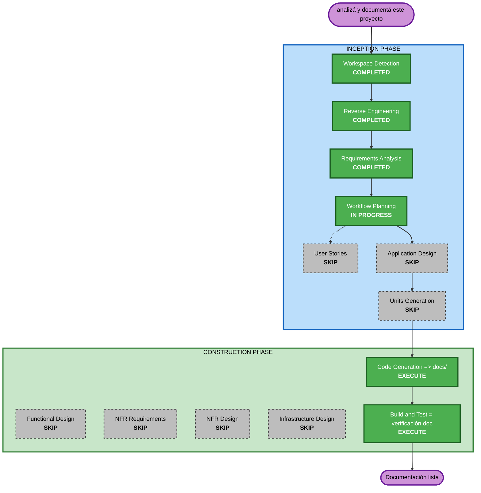

# Execution Plan — Documentación de saga

## Detailed Analysis Summary

### Transformation Scope (Brownfield)
- **Transformation Type**: Ninguna transformación de código. Entregable = **documentación** humana
  en `docs/` + plan de remediación de deuda (sin tocar código).
- **Primary Changes**: Crear archivos nuevos bajo `docs/` (y, si es NECESARIO, un link desde `README.md`).
- **Related Components**: Solo lectura del código existente como fuente de verdad. NO se modifica
  `vc/`, `lk/`, daemons, `orb/` ni configs.

### Change Impact Assessment
- **User-facing changes**: No — no cambia el comportamiento del asistente de voz.
- **Structural changes**: No — no cambia la arquitectura; la describe.
- **Data model changes**: No.
- **API changes**: No — documenta las APIs internas (HTTP del orbe + sockets), no las altera.
- **NFR impact**: No — extensiones opt-out; no se genera código con NFRs nuevos.

### Component Relationships (Brownfield)
- **Primary Component**: nueva carpeta `docs/` (documentación).
- **Source Components (solo lectura)**: `vc/`, `lk/`, `orb/`, daemons de raíz, `pyproject.toml`,
  `requirements.txt`, `.claude/CLAUDE.md`, `lk/README.md`.
- **Dependent Components**: ninguno (la doc no es dependencia de runtime).
- **Supporting Components**: artefactos de Reverse Engineering (fuente destilada).

### Risk Assessment
- **Risk Level**: **Low** — es documentación; no hay path de ejecución que romper.
- **Rollback Complexity**: Easy — borrar/editar archivos de `docs/` (y revertir el link del README).
- **Testing Complexity**: Simple — verificación = exactitud contra código + Mermaid válido + no-regresión.

## Workflow Visualization

## Phases to Execute

### 🔵 INCEPTION PHASE
- [x] Workspace Detection (COMPLETED)
- [x] Reverse Engineering (COMPLETED)
- [x] Requirements Analysis (COMPLETED)
- [x] User Stories (SKIPPED — decisión del usuario; documentación, sin features de usuario)
- [x] Workflow Planning (IN PROGRESS)
- [ ] Application Design — **SKIP**
  - **Rationale**: No se crean componentes/servicios/métodos nuevos. La doc describe los existentes.
- [ ] Units Generation — **SKIP**
  - **Rationale**: No hay descomposición en unidades. El entregable es un único conjunto de docs.

### 🟢 CONSTRUCTION PHASE
- [ ] Functional Design — **SKIP**
  - **Rationale**: Sin lógica de negocio ni modelos de datos nuevos.
- [ ] NFR Requirements — **SKIP**
  - **Rationale**: Extensiones opt-out; no se genera código con NFRs nuevos. (Exactitud/no-regresión
    de la doc se validan en Build & Test.)
- [ ] NFR Design — **SKIP**
  - **Rationale**: NFR Requirements salteado.
- [ ] Infrastructure Design — **SKIP**
  - **Rationale**: No hay infraestructura (app de escritorio local, sin cloud/IaC).
- [ ] Code Generation — **EXECUTE** (ALWAYS) → produce los archivos de `docs/`
  - **Rationale**: Es la etapa donde se "genera" el entregable. En vez de código de app, genera los
    documentos. Plan tentativo de `docs/`:
    - `docs/README.md` (índice/onboarding: qué es, setup/run, mapa, link a los demás)
    - `docs/architecture.md` (arquitectura + dos topologías, destilado de RE)
    - `docs/turn-flow.md` (flujo de un turno paso a paso, modos LiveKit y clásico, Mermaid)
    - `docs/internal-api.md` (endpoints HTTP del orbe + protocolos de los 3 sockets + modelos de datos)
    - `docs/operations.md` (saga-ctl, procesos, logs/monitor, troubleshooting, gotchas críticos)
    - `docs/code-guide.md` (recorrido archivo-por-archivo: qué hace cada módulo de vc/, lk/, daemons, orbe)
    - `docs/tech-debt-plan.md` (deuda + plan de remediación priorizado; incluye hardening y PBT-partial)
    - `README.md` raíz: link a `docs/` **solo si es NECESARIO** (sin duplicar contenido)
    - **Nota de alcance**: el usuario eligió FULL ("documenta todo"). Se incluye code-guide.md
      a pesar de solaparse parcialmente con el grafo graphify y los docstrings; se referencia el
      grafo (`graphify-out/`) y los artefactos de RE en vez de re-explicar lo ya cubierto.
- [ ] Build and Test — **EXECUTE** (ALWAYS) → verificación de la documentación
  - **Rationale**: "Test" aquí = verificar exactitud y consistencia, no compilar código:
    - Claims verificables contra el código (paths, flags, comandos, contratos de socket).
    - Mermaid válido; links internos correctos.
    - No-regresión: `py_compile` del código + `git status` confirma que solo se agregó `docs/`
      (+ a lo sumo `README.md`), sin tocar runtime.
    - Correr `tests/test_pure.py` para confirmar baseline intacto.

### 🟡 OPERATIONS PHASE
- [ ] Operations — PLACEHOLDER (sin deployment/monitoring; fuera de scope).

## Package Change Sequence (Brownfield)
No aplica multi-paquete. Secuencia simple: leer fuentes → escribir `docs/` → verificar. Sin
dependencias de orden entre documentos (se pueden escribir en cualquier orden; índice al final).

## Estimated Timeline
- **Total Stages a ejecutar**: 2 sustantivas (Code Generation = docs, Build & Test = verificación).
- **Estimated Duration**: 1 sesión (los artefactos de RE ya tienen casi todo el contenido base).

## Success Criteria
- **Primary Goal**: Documentación humana en `docs/` que sirva a onboarding + referencia técnica,
  más un plan de remediación de deuda priorizado, sin tocar el runtime.
- **Key Deliverables**: los 6 archivos de `docs/` listados arriba (+ link en README si hace falta).
- **Quality Gates**:
  - Exactitud verificable contra código (NFR-1).
  - Cero regresión de runtime: solo se agrega documentación (NFR-2).
  - Sin duplicar `.claude/CLAUDE.md` / `lk/README.md`: referenciar (NFR-3).
  - Mermaid/ASCII válidos (NFR-5); sin secretos (NFR-6).
