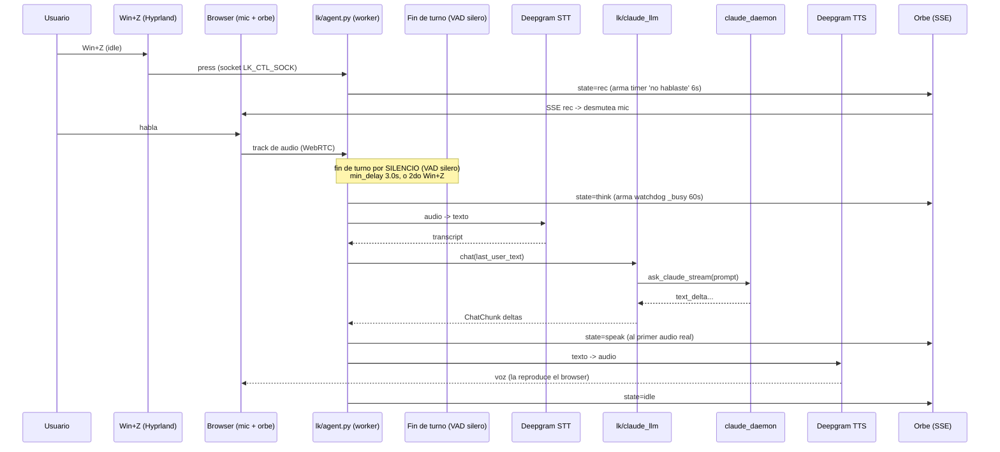

# System Architecture

## System Overview

saga es un **monolito modular de procesos cooperantes** sobre Linux/Hyprland. Todo corre local,
sin infraestructura cloud declarada. El runtime de audio lo gobierna **LiveKit-agents** en su
**modo ÚNICO: `room`** (LiveKit + transporte WebRTC): un **server LiveKit nativo** hostea una sala
donde el **browser cliente** (el orbe) publica el mic y reproduce la voz, y el **worker** (el
cerebro) hace STT/LLM/TTS. El "cerebro" es **Claude Code** corriendo como daemon persistente.
STT/TTS salen a **Deepgram** (nube) si hay key, o caen a **faster-whisper + edge-tts** locales
DENTRO del worker.

**Una sola topología (room)**. El transporte `console` y el flujo clásico standalone
(`VOICE_LIVEKIT=0`, procesos efímeros por Win+Z) fueron **ELIMINADOS en el Ciclo 4 (U7)**; ya no
existen en el código. `wake_daemon.py` (Vosk) quedó dormido, fuera de scope.

## Architecture Diagram

Topología room: **server ↔ browser cliente ↔ worker**, todo local. El audio viaja por WebRTC entre
las tres piezas; el control y el estado del orbe van por sockets Unix + HTTP loopback.

```mermaid
graph TD
    subgraph Server["livekit-server (binario nativo, local)"]
        Room["la SALA (room=saga)<br/>signaling :7880 (loopback) · media udp :7882 (LAN)"]
    end

    subgraph Client["saga-client = browser (orb/orb.html)"]
        Orb["LiveKit JS SDK (vendor)<br/>publica mic (muteado) · recibe TTS<br/>anima el orbe con la voz real (Web Audio)"]
    end

    subgraph Worker["saga-worker (lk/agent.py start)"]
        Agent["AgentSession (dueño del audio)<br/>STT/TTS · Silero VAD (fin de turno)"]
        LLM["lk/claude_llm.py (LLM custom = turn handler)"]
    end

    OServer["orb/orb_server.py<br/>HTTP :8777 (SSE + /token)"]
    Ctl["saga-ctl (vcctl.py)<br/>orquestacion _start_room"]
    WinZ["Win+Z (Hyprland)"]
    CtlSock["LK_CTL_SOCK (unix)"]
    CDaemon["claude_daemon.py<br/>(claude caliente, stream-json)"]
    CSock["/tmp/saga-claude.sock"]
    DG["Deepgram Nova-3 + Aura-2<br/>(si hay key; si no, whisper/edge local)"]

    Orb -->|publica mic track| Room
    Room -->|publica TTS track| Orb
    Room <-->|track audio| Agent
    Orb -->|GET /token /state SSE| OServer
    Ctl -->|spawnea worker fresco| Worker
    WinZ -->|press| CtlSock
    OServer -->|/say /stage -> socket| CtlSock
    CtlSock -.-> Agent
    Agent --> LLM
    LLM -->|ask_claude_stream| CSock
    CSock --> CDaemon
    Agent -->|STT/TTS| DG
    Agent -->|orb_state| OServer
```



## Component Descriptions

### livekit-server (binario nativo)
- **Purpose**: server WebRTC local que hostea la sala `saga` y enruta los tracks de audio entre
  browser cliente y worker.
- **Responsibilities**: signaling en loopback (`127.0.0.1:7880`) + media UDP (`:7882` por la IP de
  LAN); dispatch AUTOMÁTICO del worker al crearse el room. Config en `livekit.yaml`; `NODE_IP` = IP
  de LAN auto-detectada por saga-ctl (`ip route`), keys de `.env.local` vía `LIVEKIT_KEYS`.
- **Type**: Application (server), en `~/.local/bin/`. **NO Docker** (el NAT de Docker sobre
  localhost rompe el WebRTC con `dtls timeout`).

### lk/agent.py (worker)
- **Purpose**: entrypoint del worker LiveKit. Arma el `AgentServer` + el `AgentSession`
  (STT+VAD+turn+LLM+TTS) y el socket de control.
- **Responsibilities**: se construye con `AgentServer(load_fnc=lambda: 0.0, drain_timeout=0,
  num_idle_processes=1)` y se registra `@server.rtc_session()` **SIN** `agent_name` → **dispatch
  AUTOMÁTICO** (U8): el server despacha el worker solo cuando el browser crea el room. Fin de turno
  por silencio con **Silero VAD** (`turn_detection="vad"`, U10 — reemplazó el turn detector
  semántico `MultilingualModel`, liberó ~1.8 GB de RAM); config de turnos toda dentro de
  `turn_handling` (`preemptive_generation` OFF, `endpointing min_delay 3.0`, `interruption
  mode="vad"`). Socket de control `LK_CTL_SOCK` (`press`=Win+Z, `say`=texto, `stage`=panel→memoria).
  Levanta el orbe y precalienta Claude (dedup-safe). ONNX threads capados (U9) para matar el CPU
  idle del wake.
- **Dependencies**: livekit-agents, plugins (silero, deepgram — importados a NIVEL MÓDULO en el
  main thread), `lk/claude_llm`, `lk/whisper_stt`, `lk/edge_tts_plugin`, `vc/*`.
- **Type**: Application.

### lk/claude_llm.py
- **Purpose**: LLM custom de LiveKit que delega en Claude Code. Es el **ÚNICO turn handler**.
- **Responsibilities**: tomar el último turno del usuario, enganchar comandos de voz (reset,
  visión), consumir adjuntos staged (texto en memoria + imagen por dead-drop), puentear el
  generador bloqueante de `ask_claude_stream` a deltas asyncio, cancelar el generador en barge-in
  (flag global `_cancel`).
- **Dependencies**: livekit.agents.llm, `vc/claudecli`, `vc/session`, `vc/desktop`, `vc/orb`,
  `vc/attach`.
- **Type**: Application.

### lk/whisper_stt.py + lk/edge_tts_plugin.py
- **Purpose**: adaptadores STT/TTS de fallback local (faster-whisper + edge-tts).
- **Responsibilities**: corren DENTRO del worker cuando NO hay `DEEPGRAM_API_KEY`. Whisper usa
  `config.WHISPER_DECODE` (fuente única de params; `beam>=3` para evitar loops de alucinación).
- **Type**: Application.

### claude_daemon.py
- **Purpose**: mantener UN proceso `claude` (stream-json) caliente entre turnos → mata el
  cold-start.
- **Responsibilities**: spawn/respawn del CLI (grupo de proceso propio para matar el árbol),
  gestión de sesión (`--session-id` vs `--resume`), reintento ante sesión muerta, timeout por turno
  (180s), reset, protocolo socket newline-JSON, auto-apagado idle. Al cancelar (Win+Z) mata el grupo
  entero y respawnea con `--resume` (contexto intacto). Corre con `--dangerously-skip-permissions`
  por default (`VOICE_CLAUDE_SAFE=1` lo apaga) + system prompt propio y `--setting-sources ''`.
- **Dependencies**: `vc/config`, `vc/session`.
- **Type**: Application (daemon).

### vc/claudecli.py
- **Purpose**: cliente de invocación a Claude con dos caminos.
- **Responsibilities**: camino rápido (daemon socket) + fallback robusto (one-shot `claude -p`);
  imagen multimodal por stdin stream-json, reintento `--resume`/`--session-id`, respeto del flag
  global de cancelación.
- **Type**: Application.

### orb/orb_server.py
- **Purpose**: server persistente del orbe (HTTP local + SSE) + minteo de tokens.
- **Responsibilities**: servir `orb.html` + vendor LiveKit JS + Three.js; emitir ESTADO por SSE
  (~5 eventos/conversación, no audio); endpoint `/token` que mintea el JWT del cliente
  (`livekit.api.AccessToken`, solo `room_join`); puente HTTP→socket para el panel (`/state`,
  `/attach`, `/stage`, `/say`) — el browser no puede abrir un Unix socket. Solo stdlib.
- **Type**: Application (server).

### orb/orb.html (browser cliente)
- **Purpose**: cliente WebRTC de la sala; renderiza el orbe 3D (Three.js).
- **Responsibilities**: pide token a `/token`, se une al room (esto **CREA** el room y dispara el
  dispatch automático del worker), publica el mic muteado (desmutea en `rec` vía el estado SSE), se
  suscribe al track TTS, lo reproduce y **anima el orbe con el nivel real de la voz** (Web Audio
  AnalyserNode, U5). Autoplay se desbloquea en el primer gesto.
- **Type**: Application (frontend).

### vcctl.py (saga-ctl)
- **Purpose**: orquestador de arranque/parada de todo el sistema.
- **Responsibilities**: `_start_room()` levanta en orden con readiness por pieza: server fresco →
  `claude_daemon` (dedup) → orbe (dedup) → worker fresco (espera "registered worker") → browser
  (trigger del dispatch) → espera a que `LK_CTL_SOCK` responda (readiness real del agente). Server y
  worker se relanzan FRESCOS en cada `start`; claude/orb se reusan. `stop` baja todo (incluido el
  binario, match por basename, sin tocar esta sesión de claude). Ya NO despacha por API (U8).
- **Type**: Application (orquestador).

### vc/ (paquete de soporte, reusado)
- **Purpose**: piezas compartidas.
- **Responsibilities**: `config` (paths/flags/secretos/prompt/regex, `CLAUDE_MEM_DIR` autodetect),
  `session` (uuid + keywords), `attach` (adjuntos consume-once + `_pending_text`), `desktop`
  (grim/Hyprland/monitor), `runtime` (cancelación, log rotativo), `guard` (denylist bash), `orb`
  (cliente HTTP no bloqueante), `doctor`.
- **Type**: Application (librería interna).

### wake_daemon.py (dormido)
- **Purpose**: wake word Vosk con grammar restringida. **Fuera de scope** (OFF). El wake activo es
  "hey saga" server-side en el worker, opt-in (`SAGA_WAKE_ENABLED=1`); por default el trigger es
  Win+Z.
- **Type**: Application (daemon, inactivo).

## Data Flow

Turno de voz en modo room (único). El mic lo **publica el BROWSER**; el worker es headless.



Detalle clave: el orbe pasa a `speak` recién cuando el worker entra en `speaking` (primer audio
real), no en el primer token de Claude (queda en `think` mientras Claude piensa o usa tools). El
orbe **late con la voz real** que reproduce el browser. Cancelación (Win+Z en busy) →
`session.interrupt(force=True)` corta TTS + cancela el LLM; el daemon mata su grupo y respawnea con
`--resume`.

## Integration Points

- **External APIs**:
  - **Deepgram** (`/v1` STT Nova-3 + TTS Aura-2, voz `aura-2-gloria-es`) — streaming, default si
    hay `DEEPGRAM_API_KEY`.
  - **Microsoft Edge TTS** (edge-tts) — TTS de fallback local (servicio online de Microsoft, sin
    key). El STT de fallback (faster-whisper) es 100% local.
- **Local "binaries" as services**:
  - **livekit-server** — server WebRTC nativo (hostea el room).
  - **claude** (Claude Code CLI) — el cerebro, vía subprocess stream-json.
  - **grim** — captura de pantalla (Wayland, visión on-demand).
  - **mpg123 / pacat / paplay** — reproducción de audio.
  - **hyprctl / kitty / xdg-open** — integración de escritorio (monitor, abrir orbe).
- **Databases**: ninguna. Estado mínimo en archivos: `session.json` (uuid de sesión) +
  efímeros en `/tmp` (tmpfs, adjuntos consume-once).
- **Third-party Services**: Deepgram (nube) y edge-tts (fallback). Todo lo demás es local.

## Infrastructure Components

- **CDK Stacks**: N/A — no hay infraestructura cloud declarada (no CDK/Terraform/CloudFormation).
- **Deployment Model**: aplicación de escritorio single-user. Se instala con `pip install -e .` en
  un venv local; `livekit-server` binario nativo en `~/.local/bin/`; wrappers/`saga-ctl`; keybind
  de Hyprland a Win+Z. **Sin contenedores** (Docker rompe el WebRTC local).
- **Networking**: WebRTC local (signaling loopback `127.0.0.1:7880`, media UDP `:7882` por la IP de
  LAN — LiveKit nunca bindea el UDP de media a loopback). Orbe + token en `127.0.0.1:8777`. Sockets
  Unix en `/tmp` con perms `0o600` (control `LK_CTL_SOCK`, cerebro). Tráfico saliente: Deepgram
  (audio en streaming) y edge-tts en fallback.
- **Toggle de stack agéntico** (U11): `CLAUDE_PLUGINS=1` (antes `VOICE_FULL_STACK`) habilita
  plugins/MCPs agénticos opt-in para el cerebro, con `configs/plugins-blacklist`. Off por default.

## Decisiones de diseño clave

- **Server nativo, no Docker**: el NAT de Docker sobre localhost rompe el WebRTC (`dtls timeout`).
  NO volver a Docker.
- **Dispatch AUTOMÁTICO** (U8): `@server.rtc_session()` sin `agent_name` + `load_fnc=lambda: 0.0`
  (el worker nunca se auto-marca `unavailable`). Resolvió el "coin-flip" del Win+Z
  `FileNotFoundError` (la causa era el worker prod con `load_threshold=0.7` shedeándose bajo la
  carga de arranque, no las pestañas zombie). `close_on_disconnect=False` → el socket de control
  sobrevive al recargar/cerrar la pestaña. Server fresco en cada `start` = sin rooms zombie.
- **VAD puro, sin modelo semántico** (U10): `turn_detection="vad"` (Silero) cierra el turno por
  silencio; liberó ~1.8 GB de RAM y eliminó "Error predicting end of turn". La UX se mantuvo (el
  cierre ya se daba por silencio en la práctica).
- **El stack STT/TTS lo decide `DEEPGRAM_API_KEY`, no un flag**: Deepgram si está, whisper/edge si
  no. Degradación elegante (daemon→one-shot, guard fail-open): nunca queda mudo.
- **Daemons calientes**: matan el cold-start por turno (modelo/plugins/sesión en RAM).
- **god-mode + guard**: Claude corre con `--dangerously-skip-permissions`; `vc/guard.py` bloquea
  comandos bash catastróficos.
- **Privacidad**: capturas de pantalla y adjuntos se borran tras consumirse (consume-once).
```
