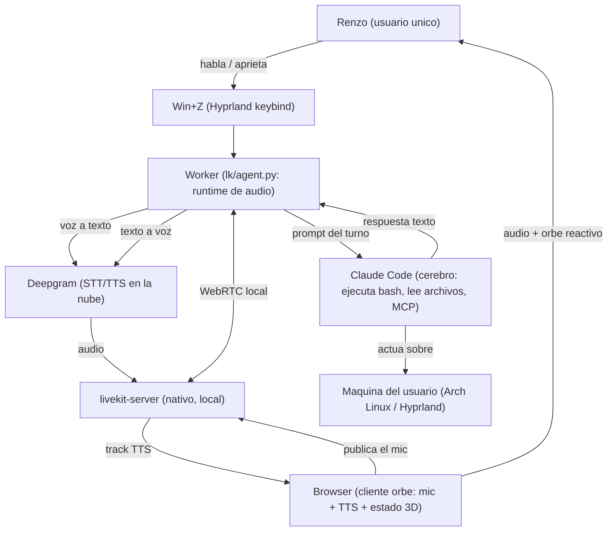

# Business Overview

## Business Context Diagram

## Business Description

- **Business Description**: saga es un asistente de voz personal para Linux/Hyprland que
  cierra el lazo **voz -> Claude Code -> voz**. A diferencia de un asistente conversacional
  plano (API de chat), el "cerebro" es **Claude Code**: puede ejecutar comandos bash, leer
  y escribir archivos, capturar la pantalla y usar herramientas/MCP. Es decir, no solo
  conversa: **actúa sobre la máquina del usuario**. La interacción es push-to-talk (Win+Z,
  o wake "hey saga" opt-in) con un orbe 3D que refleja en vivo en qué fase está el sistema y
  **late con el nivel real de la voz** que reproduce. El objetivo de producto es **latencia
  conversacional** (~2-3s de "callaste" a "te habla") y **operación manos-libres** sobre la
  computadora.

- **Modo único (ROOM)**: saga corre en un solo modo — **LiveKit + transporte ROOM**: un
  server LiveKit local (binario nativo) + el browser como cliente (orbe) que publica el mic y
  reproduce el TTS + un worker (el cerebro). No hay modo consola ni flujo clásico: se
  eliminaron (Ciclo 4 U7). Lo único que varía es el stack STT/TTS (Deepgram si hay
  `DEEPGRAM_API_KEY`, fallback local whisper + edge-tts si no) y el wake word (opt-in).

- **Business Transactions** (transacciones de negocio que implementa el sistema):
  1. **Turno de voz (push-to-talk)**: el usuario aprieta Win+Z (o dice "hey saga" con el wake
     opt-in), habla, y el sistema publica el mic en el room -> transcribe (Deepgram/whisper)
     -> manda a Claude -> reproduce la respuesta por voz mientras el orbe late con la voz
     real. Es la transacción central.
  2. **Cancelación / barge-in**: el usuario interrumpe una respuesta en curso (Win+Z mientras
     habla, o hablando encima por VAD) y el sistema mata el turno del daemon y vuelve a idle.
  3. **Visión on-demand**: el usuario referencia algo visual ("mirá la pantalla", "qué ves"),
     el sistema captura la pantalla con grim, se la adjunta a Claude, y **borra la captura**
     inmediatamente (privacidad).
  4. **Adjunto pegado desde el panel del orbe**: el usuario pega texto o imagen en la pestaña
     del orbe; el texto se stagea en memoria del agente y la imagen como dead-drop en /tmp;
     se consumen en el próximo turno (consume-once).
  5. **Prompt por texto (Shift+Enter)**: el usuario escribe en el panel del orbe y dispara un
     turno inmediato sin grabar voz (`/say` -> `generate_reply`, mismo LLM + TTS).
  6. **Staging de texto del panel**: el textarea del orbe autoguarda vía `/stage` hacia la
     memoria del agente (`take_staged()` lo consume en el turno), sin tocar filesystem.
  7. **Reset de sesión por voz**: el usuario dice "nueva sesión" / "empezamos de cero" y el
     sistema arranca una conversación limpia de Claude (respawn del daemon con uuid nueva).
  8. **Gestión del ciclo de vida** (`saga-ctl start/stop/status/restart`): levantar, apagar y
     auditar server + worker + daemon + orbe + browser.

- **Business Dictionary** (diccionario de términos del dominio):
  - **Turno**: una unidad completa de interacción: grabar -> transcribir -> Claude -> hablar.
  - **Modo ROOM**: topología única — server LiveKit nativo ↔ browser cliente (orbe) ↔ worker
    (cerebro), todo local. El browser publica el mic; el worker es headless.
  - **Push-to-talk (Win+Z)**: máquina de 3 fases — idle -> rec (grabar) -> busy (transcribir /
    pensar / hablar). Win+Z en rec corta y manda; en busy mata la respuesta.
  - **Wake word ("hey saga")**: trigger de voz opt-in (`SAGA_WAKE_ENABLED=1`), corre en el
    worker (headless) sobre el track del mic. Por default el trigger es Win+Z.
  - **Cerebro**: Claude Code corriendo como daemon caliente (`claude_daemon.py`), no una API plana.
  - **Orbe**: superficie visual 3D (Three.js, browser) que refleja el estado del sistema vía SSE
    y late con el nivel REAL de la voz TTS (Web Audio AnalyserNode).
  - **Estado/Fase**: idle, rec, think, speak, error, cancel, nueva, attach.
  - **Daemon caliente**: proceso de larga vida que mantiene modelo/sesión en RAM para matar el
    cold-start por turno (Claude tiene daemon; Whisper solo se usa en el fallback local).
  - **Stack**: el conjunto STT+TTS activo. **Deepgram** (Nova-3 + Aura-2) si hay
    `DEEPGRAM_API_KEY`; **fallback local** (faster-whisper + edge-tts) si no. No es config: lo
    decide la presencia de la key.
  - **Dispatch automático**: el worker se despacha SOLO cuando el browser se une al room
    (`@server.rtc_session()` sin agent_name, `load_fnc=0`). saga-ctl ya no despacha por API.
  - **Staging / dead-drop**: mecanismo de adjuntos. Texto = memoria del proceso agente; imagen =
    archivo efímero en /tmp (tmpfs). Ambos consume-once.
  - **God-mode**: Claude corre con `--dangerously-skip-permissions` por default (`VOICE_CLAUDE_SAFE=1`
    lo apaga).
  - **Stack agéntico (opt-in)**: `CLAUDE_PLUGINS=1` carga plugins/MCPs/skills/hooks en el daemon de
    voz (menos los de la blacklist); off = claude pelado, más rápido (U11).

## Component Level Business Descriptions

### Worker / runtime de audio (paquete `lk/`)
- **Purpose**: Orquestar el turno de voz delegando todo el runtime de audio a LiveKit-agents.
- **Responsibilities**: Push-to-talk de 3 fases, fin de turno por silencio (VAD silero puro),
  barge-in, socket de control para Win+Z y el panel, enchufar STT/LLM/TTS, wake-on-track
  (opt-in). El mic lo publica el browser; el worker es headless.

### Cerebro Claude (`claude_daemon.py` + `vc/claudecli.py`)
- **Purpose**: Ser el motor de razonamiento y acción que responde y opera la máquina.
- **Responsibilities**: Mantener un proceso `claude` caliente (stream-json), gestionar la
  sesión conversacional (uuid persistida), reintentos ante sesión muerta, timeout por turno,
  reset; fallback one-shot si el daemon cae. Con `CLAUDE_PLUGINS=1` carga el stack agéntico.

### Server LiveKit (nativo) + orquestación (`livekit-server`, `vcctl.py`)
- **Purpose**: Transporte WebRTC local entre browser y worker; ciclo de vida del sistema.
- **Responsibilities**: Server nativo (NO Docker: el NAT rompe el WebRTC local), signaling en
  loopback + media UDP en la LAN. `saga-ctl` (`_start_room`) levanta server -> daemon -> orbe
  -> worker -> browser con readiness por pieza; server y worker se relanzan frescos en cada
  start.

### Orbe / cliente (`orb/` + `orb/orb_server.py`)
- **Purpose**: Identidad visual y feedback de estado en tiempo real; cliente LiveKit y panel de
  entrada (adjuntos, prompt por texto).
- **Responsibilities**: Browser con LiveKit JS SDK: pide token a `/token`, se une al room
  (dispara el dispatch), publica el mic, reproduce el track TTS y anima el orbe con el nivel
  real de la voz. `orb_server` mintea el JWT y hace de puente HTTP->socket para adjuntos,
  staging y prompts por texto (`/state`, `/attach`, `/stage`, `/say`, `/token`).

### Soporte (paquete `vc/`)
- **Purpose**: Piezas compartidas: config/secretos, sesión, adjuntos, escritorio (grim/Hyprland),
  STT/TTS de fallback, runtime (cancelación/locks), guard de seguridad, keybind Win+Z.
- **Responsibilities**: Fuente única de configuración, helpers puros testeables, integración OS.
