# Code Structure

## Build System

- **Type**: setuptools (PEP 517) declarado en `pyproject.toml`. Lock reproducible en
  `requirements.txt` (pip freeze).
- **Configuration**:
  - `pyproject.toml`: nombre `saga`, `requires-python >=3.12`. Paquete = `vc/`; módulo suelto
    `vcctl`. Entry-point scripts: `saga = vc.app:main`, `saga-ctl = vcctl:main`.
  - Dependencias directas declaradas (LiveKit + plugins deepgram/silero, python-dotenv) y de
    fallback (faster-whisper, edge-tts). `onnxruntime` como dep del cap de threads del wake.
  - Daemons de raíz NO se instalan como módulos: se lanzan por ruta (subprocess).
- **Convención de versiones**: pins en requirements.txt; las deps LiveKit van sin pin para
  resolver la última. `.python-version` fija el intérprete local.

## Modo ÚNICO: LiveKit + transporte ROOM

El transporte console y el flujo clásico `VOICE_LIVEKIT=0` se **ELIMINARON** (Ciclo 4 U7).
Como consecuencia, ya **NO existen** en el árbol: `whisper_daemon.py`, `vc/stt.py`, `vc/tts.py`,
`vc/audio.py`, `tools/say.py`. `vc/app.py` dejó de orquestar el flujo clásico y quedó como un
entrypoint fino que sólo dispara `press` (Win+Z) al agente. `wake_daemon.py` (Vosk) sigue en el
árbol pero DORMIDO / fuera de scope.

Topología (todo local): **server LiveKit nativo ↔ browser cliente (orbe) ↔ worker (cerebro)**.
Lo único configurable: con `DEEPGRAM_API_KEY` el STT/TTS es Deepgram (Nova-3 + Aura-2), sin key
cae al fallback local (faster-whisper + edge-tts) DENTRO del agente; y el wake "hey saga" opt-in
(`SAGA_WAKE_ENABLED=1`).

## Key Classes/Modules

```mermaid
graph TD
    subgraph root["raiz del repo"]
        saga["saga.py (entrypoint fino)"]
        vcctl["vcctl.py (saga-ctl: ciclo de vida modo room)"]
        cd["claude_daemon.py (cerebro caliente)"]
        wd["wake_daemon.py (Vosk, DORMIDO)"]
    end
    subgraph lk["lk/ (worker LiveKit, modo ROOM)"]
        agent["agent.py (AgentSession)"]
        cllm["claude_llm.py (turn handler real)"]
        wstt["whisper_stt.py (fallback STT)"]
        ett["edge_tts_plugin.py (fallback TTS)"]
        onnx["onnx_tune.py (cap threads ONNX)"]
        wake["wakeword.py (wake sobre track)"]
    end
    subgraph vc["vc/ (soporte, reusado)"]
        cfg["config.py"]
        cli["claudecli.py"]
        sess["session.py"]
        att["attach.py"]
        desk["desktop.py"]
        rt["runtime.py"]
        guard["guard.py"]
        sound["sound.py"]
        orbc["orb.py"]
        doc["doctor.py"]
        app["app.py (press Win+Z)"]
    end
    subgraph orb["orb/"]
        osrv["orb_server.py (SSE + /token + puente HTTP->socket)"]
        ohtml["orb.html + vendor/three.js + vendor/livekit"]
    end
    subgraph tools["tools/ + scripts/"]
        ms["measure_stack.py (atribución del stack)"]
        rec["scripts/record_wakeword.py"]
        tr["scripts/train_wakeword.py"]
    end

    saga --> app --> cfg
    vcctl --> cfg
    agent --> cllm --> cli --> cd
    agent --> onnx
    agent --> wake
    agent --> wstt
    agent --> ett
    cllm --> sess
    cllm --> att
    cllm --> desk
    osrv --> cfg
    ms --> cd
```

## Existing Files Inventory

Archivos fuente (candidatos a modificación). Tamaños aproximados en líneas.

### Raíz
- `saga.py` (13) — Entrypoint fino. Delega en `vc.app.main`.
- `vcctl.py` (410) — `saga-ctl`: start/stop/status/restart del modo ROOM (`_start_room`).
  Levanta server nativo → daemon → orbe → worker → browser con readiness por pieza. Mata por
  pid exacto (lee /proc), nunca toca el `claude` de esta sesión.
- `claude_daemon.py` (254) — Daemon del proceso `claude` caliente (stream-json): sesión,
  `--resume`, cancelación por grupo de proceso, reintentos.
- `wake_daemon.py` (154) — Wake word Vosk (flujo clásico, DORMIDO / fuera de scope).
- `pyproject.toml` / `requirements.txt` — Build + lock de deps.
- `README.md` — Setup/run/stack/env. `.claude/CLAUDE.md` — manual operativo del repo.
- `livekit.yaml` — Config del server nativo (signaling loopback + `udp_port 7882`).

### `lk/` (worker LiveKit — modo ROOM)
- `lk/agent.py` (440) — Entrypoint del worker: `AgentServer` (auto-dispatch), `AgentSession`
  dueña de audio/STT/TTS/VAD/turnos, socket de control (`press`/`say`/`stage`), orbe, wake opt-in.
- `lk/claude_llm.py` (145) — **Turn handler real**. LLM custom → `claude_daemon` + comandos de
  voz (reset/visual) + adjuntos (texto en memoria) + visión (imagen /tmp).
- `lk/whisper_stt.py` (69) — Adaptador STT faster-whisper para LiveKit (fallback sin Deepgram).
- `lk/edge_tts_plugin.py` (48) — Plugin TTS edge-tts para LiveKit (fallback sin Deepgram).
- `lk/onnx_tune.py` (59) — U9: monkeypatch global de `InferenceSession` para cap de threads ONNX
  (`intra_op_num_threads=1` + `allow_spinning=0`) → mata el ~367% CPU idle del wake.
- `lk/wakeword.py` (121) — `WakeWordTrackDetector`: wake "hey saga" sobre el track del mic del
  browser (`rtc.AudioStream`), corre en el worker headless. Opt-in `SAGA_WAKE_ENABLED=1`.
- `lk/README.md` — Stack detallado del modo room.
- `lk/__init__.py`.

### `vc/` (soporte — reusado por el worker)
- `vc/config.py` (299) — **Fuente única** de paths, flags, voces, system prompt, regex, args de
  Claude, sockets, blacklist de plugins (`CLAUDE_PLUGINS`).
- `vc/claudecli.py` (276) — Cliente Claude: daemon (rápido, stream-json) + one-shot (fallback),
  imagen, sesión.
- `vc/session.py` (63) — Sesión uuid persistida (atomic write) + keywords de voz (reset, visual).
- `vc/attach.py` (51) — Adjuntos consume-once: texto en memoria del agente, imagen en /tmp.
- `vc/desktop.py` (60) — grim (screenshot), monitor kitty, integración Hyprland.
- `vc/runtime.py` (100) — Estado runtime: log rotativo, kill de proceso, PID-files anti-recycle
  (valida starttime de /proc).
- `vc/guard.py` (70) — **Hook PreToolUse**: denylist de bash catastrófico (rm -rf, dd, mkfs…).
  Fail-open.
- `vc/sound.py` (47) — Beep/sonidos.
- `vc/orb.py` (123) — Cliente del orbe: levanta el server, manda estado por HTTP no bloqueante.
- `vc/doctor.py` (82) — Diagnóstico del entorno (`saga --doctor`).
- `vc/app.py` (40) — Entrypoint fino: Win+Z → `press` al socket de control del agente; `--doctor`.
- `vc/__init__.py`.

### `orb/`
- `orb/orb_server.py` (299) — Server SSE + `/token` (mintea el JWT del cliente) + puente
  HTTP→socket (`/state`, `/attach`, `/stage`, `/say`). Solo stdlib.
- `orb/orb.html` — Cliente LiveKit JS: se une al room, publica mic, reproduce el track TTS y
  anima el orbe con el nivel real de la voz (Web Audio AnalyserNode). Render Three.js (bloom).
- `orb/vendor/livekit/*` — LiveKit JS SDK vendorizado.
- `orb/vendor/three/*` + `orb/vendor/addons/*` — Three.js vendorizado (postprocessing, shaders).

### `tools/`, `scripts/` y `tests/`
- `tools/measure_stack.py` (214) — Observabilidad de atribución (Ciclo 5): camina el árbol de
  procesos del daemon y atribuye RSS/%CPU por pieza (MCPs, etc.) + boot/TTFT del saga.log.
- `scripts/record_wakeword.py` (144) — Graba muestras para entrenar el wake "hey saga".
- `scripts/train_wakeword.py` (71) — Entrena/genera el modelo ONNX del wake.
- `tests/test_pure.py` (100) — Tests unittest de funciones puras (session, guard, attach, etc.).

### `configs/`
- `configs/hey_saga.yaml` — Config del wake word.
- `configs/plugins-blacklist.example.json` — Ejemplo de blacklist de plugins del stack agéntico
  (opt-in `CLAUDE_PLUGINS`; U11). `configs/plugins-blacklist.json` es la copia local activa.

## Design Patterns

### Auto-dispatch nativo (modo ROOM)
- **Location**: `lk/agent.py` (`AgentServer(load_fnc=lambda:0.0, ...)`, `@server.rtc_session()`
  sin agent_name), `orb/orb_server.py` (`/token`).
- **Purpose**: 1 room fijo / 1 agente. El browser crea el room "saga" → el server despacha el
  worker solo. NO hay dispatch explícito por API.

### Daemon caliente + cliente con fallback
- **Location**: `claude_daemon.py` / `vc/claudecli.py`.
- **Purpose**: Matar el cold-start por turno (plugins/sesión/modelo en RAM).
- **Implementation**: Daemon expone socket/stream-json; el cliente cae al one-shot `claude -p`
  si el daemon falla. **Robustez por degradación**: nunca queda mudo.

### Fuente única de configuración (single source of truth)
- **Location**: `vc/config.py` — `WHISPER_DECODE`, `build_claude_base_args()`, paths, regex,
  voces, sockets.
- **Purpose**: Evitar drift entre daemon y fallback.

### Consume-once / dead-drop para adjuntos
- **Location**: `vc/attach.py`, `orb/orb_server.py`, `vc/config.py` (ATTACH_IMG_PATH, SCREENSHOT_PATH).
- **Purpose**: Pasar texto/imagen al turno sin estado durable.
- **Implementation**: Texto en memoria del proceso agente (`/stage`); imagen como archivo /tmp
  (tmpfs) 0o600.

### Cancelación cooperativa por grupos de proceso
- **Location**: `claude_daemon.py`, spawns con `start_new_session=True`.
- **Purpose**: Barge-in/cancel (Win+Z) mata el árbol completo (incluye subspawns de claude-mem),
  sin huérfanos; respawn con `--resume` (contexto intacto).

### PID-file anti-recycle
- **Location**: `vc/runtime.py` (`self_identity` = `pid:starttime` de /proc/pid/stat).
- **Purpose**: Un PID reciclado no se hace pasar por el dueño del lock; locks auto-sanables.

### Hook de seguridad como red (fail-open denylist)
- **Location**: `vc/guard.py` inyectado vía `--settings` (aditivo).
- **Purpose**: Con god-mode + voz, un mishear no puede ejecutar un comando catastrófico.

### Cap de threads en tiempo real (ONNX)
- **Location**: `lk/onnx_tune.py`.
- **Purpose**: Modelos de audio chicos (wake/VAD) no deben spinnear #cores threads en idle.
- **Implementation**: monkeypatch global del constructor `InferenceSession` (los plugins no
  exponen `sess_options`) → 1 thread sin busy-wait.

## Critical Dependencies

### livekit-agents (+ plugins silero / deepgram)
- **Version**: sin pin (resuelve la última); ver `requirements.txt` para el lock instalado.
- **Usage**: Runtime de audio completo del worker (`lk/agent.py`).
- **Purpose**: Captura/streaming/VAD/turn/barge-in sin reimplementarlos.
- **Gotcha**: los plugins se importan a NIVEL MÓDULO (deben registrarse en el main thread).
  Turn detection = VAD puro Silero (el semántico `MultilingualModel` se quitó en U10, −1.8 GB RAM).
  BVC (noise_cancellation) requiere LiveKit Cloud → NO se usa en self-hosted.

### onnxruntime
- **Usage**: Runtime de inferencia del wake/VAD; `lk/onnx_tune.py` lo capa a 1 thread sin spin.
- **Purpose**: Evitar el ~367% CPU idle del wake (U9).

### faster-whisper
- **Usage**: STT local de fallback (`lk/whisper_stt.py`) cuando no hay Deepgram.
- **Purpose**: Transcripción offline sin key.

### edge-tts
- **Usage**: TTS de fallback (`lk/edge_tts_plugin.py`) cuando no hay Deepgram.
- **Purpose**: Voz neural multilingüe sin key.

### python-dotenv
- **Usage**: Cargar `DEEPGRAM_API_KEY` + `LIVEKIT_*` de `.env.local`.
- **Purpose**: La presencia de la key de Deepgram decide el stack STT/TTS (no es un flag).

### livekit-server (BINARIO NATIVO — dependencia externa, no pip)
- **Usage**: Server WebRTC local (`~/.local/bin/`). NO Docker (el NAT rompía el WebRTC local).
- **Purpose**: Signaling + media entre browser y worker.

### claude (Claude Code CLI) — dependencia EXTERNA de sistema (no pip)
- **Usage**: El cerebro. Invocado por subprocess (stream-json persistente y one-shot).
- **Purpose**: Razonar + actuar sobre la máquina (bash, archivos, MCP).
