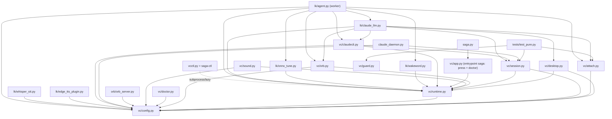

# Dependencies

> **Estado: modo ÚNICO ROOM (LiveKit server nativo + browser cliente).** El transporte console y el
> flujo clásico `VOICE_LIVEKIT=0` se ELIMINARON en Ciclo 4 U7 — con ellos se fueron los módulos
> `vc/audio.py`, `vc/stt.py`, `vc/tts.py`. `vc/app.py` quedó adelgazado al entrypoint `saga`: emite el
> `press` de Win+Z al socket de control (`_livekit_press`) + `--doctor`; el turno de voz lo corre el
> worker `lk/agent.py`. `wake_daemon.py` (Vosk) queda dormido, fuera de scope.

## Internal Dependencies

### Observaciones del grafo interno
- **`vc/config.py` es la raíz**: casi todo depende de él (paths/flags/constantes). Sin lógica ni imports internos.
- **`vc/runtime.py` centraliza estado mutable** (cancelación, procesos, PID-files) para evitar ciclos de import.
- **`vc/` no depende de `lk/`** (dependencia unidireccional: `lk/` reusa `vc/`).
- **`lk/agent.py` es el worker del turno de voz** (corre `entry()` al despacharse). `saga.py`/`vc/app.py`
  quedaron adelgazados al entrypoint `saga` (emisor del `press` de Win+Z + `--doctor`) tras eliminar el
  flujo clásico (U7); ya no corren el turno.
- **`lk/claude_llm.py` es el ÚNICO turn handler**: punto de integración del flujo de voz con el soporte `vc/`.
- **Plugins fallback** (`lk/whisper_stt.py`, `lk/edge_tts_plugin.py`) solo entran si NO hay `DEEPGRAM_API_KEY`;
  ambos importan `vc/config` (params únicos de decodificación / voz edge).

### Dependencias [tipo] notables
- `lk/agent.py` depende de `vc/*` — **Runtime** — reusa orquestación, adjuntos, cerebro, orbe.
- `claude_daemon.py` depende de `vc/config` + `vc/session` — **Runtime** — args base + sesión uuid.
- `lk/whisper_stt.py` depende de `vc/config` (`WHISPER_DECODE`) — **Runtime** — params únicos de decodificación.
- `tests/test_pure.py` depende de `vc/session`, `vc/guard`, `vc/attach` — **Test** (funciones puras).

## External Dependencies

> Dependencias DIRECTAS = lo que declara `pyproject.toml` (lo que el código importa). El lock reproducible
> vive en `requirements.txt` (pip freeze). **No se inventan pins acá**: livekit-* y python-dotenv van SIN pin
> (resuelven la última); solo llevan `==` los que ya lo declaran en `pyproject.toml`.

### Paquetes pip (`pyproject.toml` → `[project.dependencies]`)

#### livekit-agents (+ plugins)
- **Version**: sin pin (resuelve la última). Incluye los plugins declarados aparte:
  `livekit-plugins-silero`, `livekit-plugins-deepgram`, `livekit-plugins-noise-cancellation`,
  `livekit-plugins-turn-detector`.
- **Purpose**: runtime de audio del modo ROOM (AgentSession: captura/streaming/STT/TTS/VAD/turn/barge-in).
- **Importados a nivel módulo en `lk/agent.py`**: `silero` (VAD) + `deepgram` (STT/TTS). Deben registrarse
  en el main thread (importarlos tarde crashea).
- **`livekit-plugins-turn-detector` — DECLARADO pero YA NO USADO en runtime.** En U10 el turn detection pasó
  a **VAD puro** (`turn_detection="vad"`), reemplazando el EOU semántico `MultilingualModel` → liberó ~1.8 GB
  de RAM. El paquete sigue en `pyproject.toml`/instalado, pero el worker no lo carga. Candidato a remover.
- **`livekit-plugins-noise-cancellation` (BVC) — DECLARADO pero INERTE en self-hosted.** Requiere LiveKit
  Cloud; en modo room self-hosted da "audio filter cannot be enabled". No se habilita.
- **License**: Apache-2.0 (LiveKit). BVC/Krisp y el modelo de turn-detector tienen términos propios.

#### livekit-wakeword[listener]
- **Version**: sin pin. Extra `[listener]`.
- **Purpose**: wake word "hey saga" (opt-in, `SAGA_WAKE_ENABLED=1`). Cableado en `lk/wakeword.py`
  (`WakeWordTrackDetector`), importado por `lk/agent.py`.
- **License**: Apache-2.0 (LiveKit).

#### faster-whisper
- **Version**: `==1.2.1` (transitivas: `ctranslate2`, `tokenizers`, `onnxruntime`, `av`, `huggingface_hub`).
- **Purpose**: STT local de fallback (`lk/whisper_stt.py`) cuando NO hay `DEEPGRAM_API_KEY`.
- **License**: MIT.

#### edge-tts
- **Version**: `==7.2.8`.
- **Purpose**: TTS de fallback (`lk/edge_tts_plugin.py`, Microsoft Edge Neural, online sin key).
- **License**: GPL-3.0.

#### onnxruntime
- **Version**: `==1.26.0` (en `requirements.txt`; entra como transitiva de faster-whisper/silero, pero se
  usa DIRECTO en `lk/onnx_tune.py`).
- **Purpose**: `cap_onnx_threads()` capa los threads ONNX (U9) para matar el ~367% CPU idle del wake / VAD.
- **License**: MIT.

#### numpy
- **Version**: `==2.4.6`.
- **Purpose**: buffers de audio / reshape para el STT fallback (`lk/whisper_stt.py`).
- **License**: BSD-3.

#### python-dotenv
- **Version**: sin pin.
- **Purpose**: cargar `DEEPGRAM_API_KEY` + `LIVEKIT_*` de `.env.local`. La PRESENCIA de la key decide el
  stack (Deepgram vs fallback) — no hay flag de proveedor.
- **License**: BSD-3.

#### sounddevice
- **Version**: `==0.5.5` (transitiva `cffi`).
- **Purpose**: captura de mic para el wake_daemon Vosk (DORMIDO) + health-check `vc/doctor.py`. Ya no lo usa
  el flujo principal (el mic real lo publica el browser vía WebRTC).
- **License**: MIT.

#### vosk
- **Version**: sin pin (instalado a mano, sin metadata pip → no fijable en `pyproject.toml`).
- **Purpose**: wake word local del `wake_daemon.py` (DORMIDO, fuera de scope).
- **License**: Apache-2.0.

## Dependencias VENDOREADAS (JS del browser, NO pip)

El cliente `orb/orb.html` es un browser sin bundler; sus libs viven versionadas en el repo bajo `orb/vendor/`:

- **LiveKit JS Client SDK** — `orb/vendor/livekit/livekit-client.esm.mjs` (+ `orb/vendor/addons`).
  - **Purpose**: el browser se une al room, pide token a `/token`, publica el mic y reproduce el track TTS.
  - **License**: Apache-2.0.
- **Three.js** — `orb/vendor/three/three.module.js`.
  - **Purpose**: render del orbe 3D reactivo (bloom, animación por nivel real de la voz vía Web Audio).
  - **License**: MIT.

> Ninguna de las dos es dependencia pip; se sirven estáticas desde `orb_server.py`. Actualizarlas = reemplazar
> el archivo vendoreado, no `pip install`.

## Binario NATIVO (NO pip, NO Docker)

- **livekit-server** — binario nativo en `~/.local/bin/livekit-server` (~50 MB).
  - **Purpose**: server LiveKit local (signaling loopback + media UDP en la IP de LAN). Config `livekit.yaml`.
  - **Por qué nativo**: el NAT de Docker sobre localhost rompe el WebRTC (`dtls timeout`). NO volver a Docker.
  - **Lanzado por**: `saga-ctl` (`_start_room`), FRESCO en cada `start`. Keys de `.env.local` vía `LIVEKIT_KEYS`,
    `NODE_IP` auto-detectada por `ip route`.
  - **License**: Apache-2.0 (LiveKit).

## Servicios EXTERNOS (no paquetes)

- **Deepgram** (OPCIONAL, por key) — STT Nova-3 (`nova-3`, es) + TTS Aura-2 (`aura-2-gloria-es`), streaming.
  - **Activación**: presencia de `DEEPGRAM_API_KEY` en `.env.local`. Sin key → fallback local
    (faster-whisper + edge-tts) DENTRO del agente. No hay flag de proveedor: lo decide la key.
  - **Red**: requiere salida a la API de Deepgram (cloud).
- **Claude Code CLI** (`claude`) — **el cerebro**, dependencia de SISTEMA (no en `requirements.txt`; debe estar
  en PATH). Corre en daemon persistente (`claude_daemon.py`, stream-json) con fallback one-shot `claude -p`.
  claude-mem corre hooks de memoria ~2s por turno (cuello de latencia).
- **Binarios de sistema (pacman)**: `grim` (screenshot/visión), `hyprctl`, `kitty`, `xdg-open`, `mpg123`
  (audio fallback). Asumen Arch + Hyprland + Wayland.

## Riesgos de dependencias (resumen)
- **LiveKit sin pin en `pyproject.toml`**: tracking de la última puede romper en upgrades (API drift ya sufrido
  en la migración a AgentServer/auto-dispatch). Mitigado por el lock de `requirements.txt`.
- **`livekit-plugins-turn-detector` declarado pero muerto en runtime (U10)**: peso/instalación sin uso.
  Remover cuando se confirme que nada lo carga.
- **`livekit-plugins-noise-cancellation` (BVC) inerte en self-hosted**: solo funciona en LiveKit Cloud.
- **edge-tts GPL-3.0**: relevante si cambiara la licencia/distribución del proyecto.
- **Acoplamiento a binarios externos** (`claude`, `livekit-server`, `grim`, `hyprctl`, `mpg123`): el sistema
  asume Arch + Hyprland + Wayland; no es portable sin ellos.
- **`vosk` sin metadata pip**: no reproducible por `pip freeze`; instalación manual frágil (aunque dormido).
