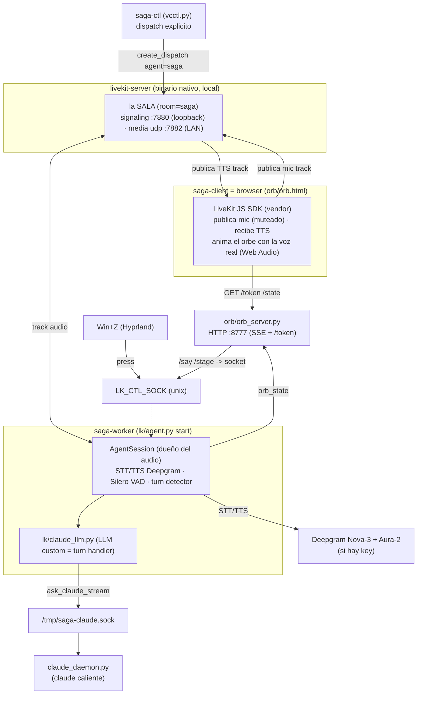

# Arquitectura

saga es un **monolito modular de procesos cooperantes** sobre Linux/Hyprland. Todo corre local. El
runtime de audio lo gobierna **LiveKit-agents** en modo `room` (default, Ciclo 4): un **server LiveKit
nativo** hostea una sala WebRTC donde el **browser cliente** (el orbe) publica el mic y recibe la voz, y
el **worker** (el cerebro) hace STT/LLM/TTS. El "cerebro" es **Claude Code** corriendo como daemon
persistente. STT/TTS salen a **Deepgram** si hay key, o caen a **faster-whisper + edge-tts** locales.

> Documento de referencia para mantenedores. Describe el sistema tal como está en el código.

## Topología room (server ↔ cliente ↔ worker)

En modo room el audio viaja por **WebRTC** entre tres piezas locales: el **server** (binario nativo) hostea
la sala; el **browser cliente** publica el track de mic y reproduce el track TTS; el **worker** recibe el mic,
lo transcribe, piensa y publica la voz de respuesta.

**Flujo de un turno**: Win+Z → `press` por el socket de control → el cliente desmutea el mic (estado `rec`
vía SSE) → el server enruta el track al worker → STT (Deepgram) transcribe → VAD + turn detector semántico
cierran el turno → LLM (Claude vía daemon) → TTS (Deepgram) genera la voz → el worker **publica el track TTS**
al room → el browser lo reproduce y **anima el orbe con el nivel real de la voz** (Web Audio AnalyserNode).

## Modo único: room (LiveKit + transporte WebRTC)

saga tiene **un solo modo de transporte**: room. El audio viaja por WebRTC entre server, browser cliente y
worker (ver topología arriba). El Ciclo 4 (U7) eliminó el transporte console y el flujo clásico standalone.

| Pieza | Cómo |
|---|---|
| Dueño del audio | `lk/agent.py start` (LiveKit-agents, conectado al server) |
| Transporte | WebRTC (server ↔ browser ↔ worker) |
| Captura/VAD/turn/barge-in | LiveKit (Silero VAD + turn detector semántico) |
| STT | Deepgram Nova-3 (o faster-whisper local, `lk/whisper_stt.py`, sin key) |
| TTS | Deepgram Aura-2 (o edge-tts local, `lk/edge_tts_plugin.py`, sin key) |
| Sync del orbe | sí (track TTS real → Web Audio AnalyserNode) |
| Wake word | Win+Z; "hey saga" server-side opt-in (`SAGA_WAKE_ENABLED=1`) |

**El stack STT/TTS lo decide la presencia de `DEEPGRAM_API_KEY`** en `.env.local`, no un flag. El fallback
local (faster-whisper + edge-tts) corre DENTRO del agente, sin daemons separados.

## Capas del modo room

- **Server** — `livekit-server` **binario nativo** en `~/.local/bin/` (NO Docker: el NAT de Docker sobre
  localhost rompe el WebRTC con `dtls timeout`). Config `livekit.yaml`: signaling en loopback (`:7880`) +
  `udp_port: 7882` para media. `node_ip` se inyecta por env `NODE_IP` = IP de LAN auto-detectada por saga-ctl
  (`ip route`), porque LiveKit nunca bindea el UDP de media a loopback. Keys de `.env.local` (`LIVEKIT_KEYS`).
- **Worker** (`lk/agent.py start`) — el cerebro. `AgentSession` dueña del audio/STT/TTS/VAD/turn detection.
  Se registra como agente NOMBRADO (`@server.rtc_session(agent_name="saga")`, dispatch explícito). Default:
  STT `deepgram.STT(nova-3, es)` + TTS `deepgram.TTS(aura-2-gloria-es)` + Silero VAD + turn detector semántico
  (`MultilingualModel`, anti-chopping). LLM custom `lk/claude_llm.py` reenvía al `claude_daemon`. Socket de
  control `LK_CTL_SOCK` (`press`=Win+Z, `say`=texto, `stage`=panel→memoria).
- **Cliente** (`orb/orb.html`) — browser con LiveKit JS SDK (vendoreado en `orb/vendor/livekit/`). Pide token a
  `/token`, se une al room, publica el mic (muteado; desmutea en `rec` vía el estado SSE), se suscribe al track
  TTS, lo reproduce y **anima el orbe con el nivel real de la voz** (Web Audio AnalyserNode).
- **Token + dispatch** — `orb/orb_server.py` `/token` mintea el JWT del cliente (`livekit.api.AccessToken`).
  saga-ctl hace `AgentDispatchService.create_dispatch(agent_name=saga, room=saga)` al arrancar → el agente entra
  al room ANTES que el browser (robusto contra timing y pestañas zombie).
- **Orquestación** (`vcctl.py` = `saga-ctl`, `_start_room()`) — levanta en orden con readiness por pieza:
  server nativo → `claude_daemon` → orbe → worker → dispatch → browser. `stop` baja todo (incluido el binario,
  match por basename, sin tocar esta sesión de claude).

## Componentes y responsabilidades

- **`livekit-server`** — server WebRTC nativo: hostea el room, enruta los tracks de audio entre cliente y worker.
- **`lk/agent.py`** — worker LiveKit: arma el `AgentSession` (STT+VAD+turn+LLM+TTS), socket de control, agente
  nombrado para dispatch explícito. Levanta el orbe y precalienta Claude (dedup-safe).
- **`lk/claude_llm.py`** — el turn handler real: toma el último turno, engancha comandos de voz
  (reset, visión), consume adjuntos, delega en `claude_daemon`.
- **`lk/whisper_stt.py` + `lk/edge_tts_plugin.py`** — adaptadores STT/TTS de fallback local (faster-whisper +
  edge-tts) que corren DENTRO del agente cuando no hay `DEEPGRAM_API_KEY`.
- **`claude_daemon.py` + `vc/claudecli.py`** — el cerebro: un proceso `claude` caliente (stream-json) + cliente
  con fallback a one-shot.
- **`orb/orb_server.py` + `vc/orb.py`** — orbe: server SSE local + endpoint `/token` (JWT del cliente) + puente
  HTTP→socket (el browser no puede abrir un Unix socket).
- **`vc/`** — soporte reusado: config, sesión, adjuntos, escritorio, runtime, guard.
- **`wake_daemon.py`** — wake word Vosk, DORMIDO (fuera de scope; el wake activo es "hey saga" server-side en el agente).

## Integraciones y transporte

- **Externas**: Deepgram (STT/TTS, nube), Microsoft Edge TTS (fallback), Claude Code CLI (cerebro).
- **Binarios de sistema**: `livekit-server` (server WebRTC), `grim` (screenshot), `mpg123`/`pacat`/`paplay`
  (audio), `hyprctl`/`kitty`/`xdg-open` (escritorio).
- **Transporte de audio (room)**: WebRTC entre browser ↔ server ↔ worker (loopback ~ms). Signaling en
  `127.0.0.1:7880`; media UDP `:7882` por la IP de LAN.
- **Transporte de control local**: sockets Unix (control del agente `LK_CTL_SOCK`, cerebro) con perms
  `0o600` + HTTP loopback `127.0.0.1:8777` (orbe + token). Ver `internal-api.md`.
- **Estado**: sin base de datos. `session.json` (uuid de sesión) + efímeros en `/tmp` (tmpfs).

## Decisiones de diseño clave

- **Server nativo, no Docker**: el NAT de Docker sobre localhost rompe el WebRTC (`dtls timeout`); el binario
  nativo evita el problema. El modo room además descarta los frames con el track detached cuando el mic está
  apagado (mecanismo nativo `room_io/_input.py`) → sin backlog de audio.
- **Dispatch explícito**: el worker no auto-despacha; saga-ctl crea el dispatch al arrancar → el agente entra al
  room antes que el browser (sin `FileNotFoundError` por pestañas zombie).
- **Degradación elegante**: Deepgram→whisper/edge (dentro del agente); daemon→one-shot; guard fail-open.
  Nunca queda mudo.
- **Daemons calientes**: matan el cold-start por turno (modelo/plugins/sesión en RAM).
- **god-mode + guard**: Claude corre con `--dangerously-skip-permissions`; un hook (`vc/guard.py`) bloquea
  comandos bash catastróficos.
- **Privacidad**: capturas de pantalla y adjuntos se borran tras consumirse (consume-once).

Para qué hace cada archivo, ver `code-guide.md`. Para el flujo paso a paso, ver `turn-flow.md`.
