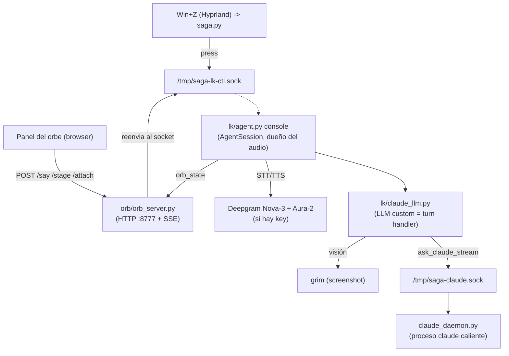

# Arquitectura

saga es un **monolito modular de procesos cooperantes** sobre Linux/Hyprland. No hay servidor
central ni red entrante: todo corre local, coordinado por **sockets Unix** y **un puerto HTTP
local** (el orbe). El runtime de audio lo gobierna **LiveKit-agents** en modo `console`. El
"cerebro" es **Claude Code** corriendo como daemon persistente. STT/TTS salen a **Deepgram** si
hay key, o caen a **faster-whisper + edge-tts** locales.

> Documento de referencia para mantenedores. Describe el sistema tal como está en el código.

## Dos topologías (según `VOICE_LIVEKIT`)

| | Modo LiveKit (default) | Modo clásico (fallback, `VOICE_LIVEKIT=0`) |
|---|---|---|
| Dueño del audio | `lk/agent.py console` (LiveKit-agents) | proceso efímero por Win+Z (`saga.py` → `vc/app.py`) |
| Captura/VAD/turn/barge-in | LiveKit | `vc/audio.py` (sounddevice + VAD Silero) |
| STT | Deepgram Nova-3 (o whisper local) | `whisper_daemon.py` (faster-whisper caliente) |
| TTS | Deepgram Aura-2 (o edge-tts) | `vc/tts.py` (edge-tts → mpg123) |
| Wake word | — | `wake_daemon.py` (Vosk, OFF por default) |

**El stack STT/TTS lo decide la presencia de `DEEPGRAM_API_KEY`** en `.env.local`, no un flag.

## Diagrama de componentes (modo LiveKit, default)

## Componentes y responsabilidades

- **`lk/agent.py`** — entrypoint LiveKit: arma el `AgentSession` (STT+VAD+LLM+TTS), push-to-talk
  de 3 fases, fin de turno por silencio (~2s), barge-in, cancelación de ruido (BVC), socket de
  control. Levanta el orbe y precalienta Claude (single-owner).
- **`lk/claude_llm.py`** — el turn handler real del modo default: toma el último turno, engancha
  comandos de voz (reset, visión), consume adjuntos, delega en `claude_daemon`.
- **`claude_daemon.py` + `vc/claudecli.py`** — el cerebro: un proceso `claude` caliente
  (stream-json) + cliente con fallback a one-shot.
- **`orb/orb_server.py` + `vc/orb.py`** — orbe: server SSE local + cliente HTTP no bloqueante.
- **`vc/`** — soporte reusado: config, sesión, adjuntos, escritorio, runtime, guard, STT/TTS/audio.
- **Daemons del flujo clásico** — `whisper_daemon.py` (STT caliente), `wake_daemon.py` (Vosk).

## Integraciones y transporte

- **Externas**: Deepgram (STT/TTS, nube), Microsoft Edge TTS (fallback), Claude Code CLI (cerebro).
- **Binarios de sistema**: `grim` (screenshot), `mpg123`/`pacat`/`paplay` (audio),
  `hyprctl`/`kitty`/`xdg-open` (escritorio).
- **Transporte local**: 3 sockets Unix (control del agente, cerebro, whisper) con perms `0o600`
  + HTTP loopback `127.0.0.1:8777` (orbe). Ver `internal-api.md`.
- **Estado**: sin base de datos. `session.json` (uuid de sesión), `word_aliases.json`
  (fonetizaciones), efímeros en `/tmp` (tmpfs).

## Decisiones de diseño clave

- **Degradación elegante**: Deepgram→whisper/edge, daemon→one-shot, guard fail-open. Nunca queda mudo.
- **Daemons calientes**: matan el cold-start por turno (modelo/plugins/sesión en RAM).
- **god-mode + guard**: Claude corre con `--dangerously-skip-permissions`; un hook (`vc/guard.py`)
  bloquea comandos bash catastróficos.
- **Privacidad**: capturas de pantalla y adjuntos se borran tras consumirse (consume-once).

Para qué hace cada archivo, ver `code-guide.md`. Para el flujo paso a paso, ver `turn-flow.md`.
