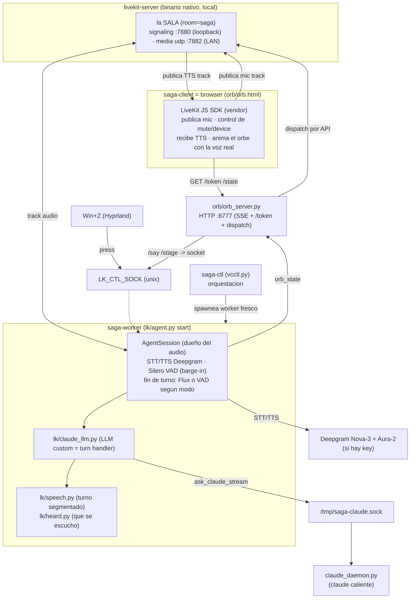

# Arquitectura

saga es un **monolito modular de procesos cooperantes** sobre Linux/Hyprland. Todo corre local. El
runtime de audio lo gobierna **LiveKit-agents** en modo `room` (default, Ciclo 4): un **server LiveKit
nativo** hostea una sala WebRTC donde el **browser cliente** (el orbe) publica el mic y recibe la voz, y
el **worker** (el cerebro) hace STT/LLM/TTS. El "cerebro" es **Claude Code** corriendo como daemon
persistente. STT/TTS salen a **Deepgram** si hay key, o caen a **faster-whisper + edge-tts** locales.

> Documento de referencia para mantenedores. Describe el sistema tal como está en el código.

## Topología room (server ↔ cliente ↔ worker)

En modo room el audio viaja por **WebRTC** entre tres piezas locales: el **server** (binario nativo) hostea
la sala; el **browser cliente** publica el track de mic y reproduce el track TTS; el **worker** recibe el mic,
lo transcribe, piensa y publica la voz de respuesta.



**Flujo de un turno**: Win+Z → `press` por el socket de control → el cliente desmutea el mic (estado `rec`
vía SSE) → el server enruta el track al worker → STT (Deepgram) transcribe → el VAD (silero) cierra el turno
por silencio → LLM (Claude vía daemon) → TTS (Deepgram) genera la voz → el worker **publica el track TTS**
al room → el browser lo reproduce y **anima el orbe con el nivel real de la voz** (Web Audio AnalyserNode).

## Modo único: room (LiveKit + transporte WebRTC)

saga tiene **un solo modo de transporte**: room. El audio viaja por WebRTC entre server, browser cliente y
worker (ver topología arriba). El Ciclo 4 (U7) eliminó el transporte console y el flujo clásico standalone.

| Pieza | Cómo |
|---|---|
| Dueño del audio | `lk/agent.py start` (LiveKit-agents, conectado al server) |
| Transporte | WebRTC (server ↔ browser ↔ worker) |
| Captura/barge-in | LiveKit (Silero VAD) |
| Fin de turno | **depende del modo**: Flux (`turn_detection="stt"`) en llamada, Silero VAD en push-to-talk |
| STT | Deepgram **Flux** (llamada) / **Nova-3** (push-to-talk) — o faster-whisper local sin key |
| TTS | Deepgram Aura-2 (o edge-tts local, `lk/edge_tts_plugin.py`, sin key) |
| Cerebro | Claude Code vía `claude_daemon` (o `SAGA_LLM=gemini`: LLM en la nube, sin tools) |
| Sync del orbe | sí (track TTS real → Web Audio AnalyserNode) |
| Wake word | Win+Z; "hey saga" server-side opt-in (`SAGA_WAKE_ENABLED=1`) |

## Los dos modos de turno

`SAGA_MODE` (env, default `ptt`) ramifica `_turn_handling()` en `lk/agent.py`:

| | `ptt` (default) | `call` |
|---|---|---|
| Win+Z | un toque por turno (3 fases) | levanta el tubo / cuelga |
| Mic | se abre al grabar, se cierra al mandar | **queda abierto** |
| Fin de turno | `turn_detection="vad"` + `endpointing.min_delay=1.2s` | `turn_detection="stt"` → lo decide **Flux** |
| STT | Nova-3 | Flux `flux-general-multi` (`eot=0.7`, `eager_eot=0.6`) |
| Cierre | volvés a idle en cada turno | cuelga sola tras 180s sin actividad |

**Por qué Flux para la llamada**: el piso fijo de silencio se paga entero en CADA turno, aunque la
frase esté obviamente terminada. Flux decide con señales acústicas Y lingüísticas, así que corta en
~0.5s cuando la frase cerró y se toma más cuando queda ambigua. `eager_eot` además arranca a
generar antes de confirmar; si seguís hablando, Deepgram manda `TurnResumed` y cancela.

**Interrupción (barge-in)**: `mode="vad"` hardcodeado en los dos modos. El modo `adaptive` de
LiveKit —el detector ML que distingue un "ajá" de un corte real, y lo único que habilita
`backchannel_boundary`— **no se puede usar acá**: `AdaptiveInterruptionDetector` se construye
contra `LIVEKIT_INFERENCE_URL`/`API_KEY`, o sea LiveKit Cloud, y saga corre un server local. Sin él,
lo que filtra los cortes por ruido son dos parámetros locales del framework: `min_words` (2) y
`min_duration` (0.5). Con `min_words` en su default (0), **una sola palabra mal transcripta cortaba
una respuesta de 20 segundos**. Hay un test canario para el día que `adaptive` se pueda self-hosted.

**`preemptive_generation` de LiveKit queda OFF en los dos modos**: la generación especulativa que
queremos es la de Flux (`eager_eot`), que cancela vía `TurnResumed` antes de commitear. La de
LiveKit corre sobre transcripts parciales y hace multi-commit contra el bridge bloqueante del
daemon → turnos partidos sin respuesta. Una sola fuente de especulación.

**El stack STT/TTS lo decide la presencia de `DEEPGRAM_API_KEY`** en `.env.local`, no un flag. El fallback
local (faster-whisper + edge-tts) corre DENTRO del agente, sin daemons separados.

## Capas del modo room

- **Server** — `livekit-server` **binario nativo** en `~/.local/bin/` (NO Docker: el NAT de Docker sobre
  localhost rompe el WebRTC con `dtls timeout`). Config `livekit.yaml`: signaling en loopback (`:7880`) +
  `udp_port: 7882` para media. `node_ip` se inyecta por env `NODE_IP` = IP de LAN auto-detectada por saga-ctl
  (`ip route`), porque LiveKit nunca bindea el UDP de media a loopback. Keys de `.env.local` (`LIVEKIT_KEYS`).
- **Worker** (`lk/agent.py start`) — el cerebro. `AgentSession` dueña del audio/STT/TTS/VAD/turn detection.
  `AgentServer(load_fnc=lambda: 0.0, drain_timeout=0, num_idle_processes=1)`; el dispatch lo pide
  `orb_server` por API cuando el cliente va a entrar → `entry()` → socket de control. STT según modo
  (Flux en llamada, Nova-3 en push-to-talk) + TTS `deepgram.TTS(aura-2-gloria-es)` + Silero VAD para el
  barge-in (en push-to-talk además cierra el turno; U10 sacó el `MultilingualModel` semántico → −1.8 GB
  de RAM). Toda la config de turnos va en `turn_handling=` (los params top-level están deprecados y se
  ignoran cuando se pasa ese dict). LLM custom `lk/claude_llm.py` reenvía al `claude_daemon`. Socket de
  control `LK_CTL_SOCK` (`press`=Win+Z, `say`=texto, `stage`=panel→memoria).
- **Cliente** (`orb/orb.html`) — browser con LiveKit JS SDK (vendoreado en `orb/vendor/livekit/`). Pide token a
  `/token`, se une al room, publica el mic, se suscribe al track TTS, lo reproduce y **anima el orbe con
  el nivel real de la voz** (Web Audio AnalyserNode). El mic arranca muteado y lo gatea el estado del orbe
  (`rec` → unmute); con `SAGA_WAKE_ENABLED=1` queda **desmuteado siempre**, para que el server oiga
  "hey saga". Encima de ese gate hay un **control manual** (mute con clic o tecla `M`, y selector de
  dispositivo vía `Room.getLocalDevices` / `room.switchActiveDevice`); el mute manual le gana al gate.
- **Token + dispatch** — `orb/orb_server.py` `/token` mintea el JWT del cliente
  (`livekit.api.AccessToken`) **y pide el dispatch por API** (`vc/dispatch.py`). Si el dispatch falla,
  el token igual sale: no dejamos al cliente sin poder entrar por un problema del agente.
- **Orquestación** (`vcctl.py` = `saga-ctl`, `_start_room()`) — levanta en orden con readiness por pieza:
  server fresco → `claude_daemon` (dedup) → orbe (dedup) → worker fresco (espera "registered worker") → browser
  (trigger del dispatch) → espera a que el socket de control `LK_CTL_SOCK` responda (readiness real del agente).
  `stop` baja todo (incluido el binario, match por basename, sin tocar esta sesión de claude).

## Quién es dueño del contexto (la decisión que explica media arquitectura)

En un agente LiveKit normal, **el framework es dueño de la conversación**: mantiene un
`ChatContext`, se lo pasa al LLM en cada `llm.chat(chat_ctx=...)`, y cuando lo interrumpís
guarda el mensaje del asistente con **solo lo que llegó a sonar**:

```python
# livekit/agents/voice/agent_activity.py
msg = llm.ChatMessage(role="assistant", content=[forwarded_text], interrupted=True)
```

El turno siguiente ve ese historial ya recortado. Cero código propio.

**saga rompe ese contrato a propósito.** `lk/claude_llm.py` **ignora el `chat_ctx`**: la
conversación multivuelta vive en la sesión del CLI de Claude, que se reanuda con `--resume` (uuid
persistido en `session.json`). Eso es lo que da el cerebro agéntico — Claude recuerda qué comandos
corrió y qué archivos leyó, no solo lo que dijo en voz alta, y el `chat_ctx` de LiveKit solo
guardaría el texto hablado.

### Lo que cuesta esa decisión

| | LiveKit dueño del contexto | Claude dueño (**hoy**) |
|---|---|---|
| Truncación al interrumpirte | nativa | `lk/heard.py` la transporta a mano |
| Memoria del trabajo agéntico | solo texto hablado | **completa** (tools incluidas) |
| Tamaño de la conversación | lo maneja el framework | **crece sin límite** hasta un reset por voz |
| Costo de interrumpir | cancelar un task | matar el proceso + `--resume` en frío |
| Turno con huecos de tools | no aplica | `lk/speech.py`, bloques a mano |

Las cuatro consecuencias de la derecha son **la misma causa**, no cuatro problemas sueltos:

1. **`lk/heard.py`** — dos memorias que no coinciden. LiveKit sabe hasta dónde sonó la voz; Claude
   cree que dijo todo. El módulo lee el `text_content` ya truncado por el framework y se lo pasa a
   Claude como una nota de sistema en el próximo prompt. No reimplementa la truncación: la
   transporta por el hueco que abre nuestra propia arquitectura.
2. **`lk/speech.py`** — un turno de Claude no es un stream continuo (`texto → hueco de tools →
   texto`), y el websocket del TTS de Deepgram muere por inactividad en el hueco. Ver
   [`turn-flow.md`](turn-flow.md).
3. **La sesión no expira.** Medido: 823 mensajes / 816 KB tras un día de uso.
4. **Interrumpir cuesta ~3.9s.** Medido: 1.67s con el proceso caliente contra 5.98s tras un
   respawn. De esos, ~2.5s son arrancar el proceso y ~1.4s recargar la sesión.

> El CLI expone `subtype:"interrupt"` en su protocolo de control por stdin — el mismo stdin que ya
> usamos con `--input-format stream-json`. Abortar el turno sin matar el proceso es posible y no
> está hecho. Ver [`tech-debt-plan.md`](tech-debt-plan.md).

## Componentes y responsabilidades

- **`livekit-server`** — server WebRTC nativo: hostea el room, enruta los tracks de audio entre cliente y worker.
- **`lk/agent.py`** — worker LiveKit: arma el `AgentServer` (dispatch automático, `load_fnc=0`,
  `num_idle_processes=1`, `drain_timeout=0`) + el `AgentSession` (STT+VAD+turn+LLM+TTS) y el socket de control.
  Levanta el orbe y precalienta Claude (dedup-safe).
- **`lk/claude_llm.py`** — el turn handler real: toma el último turno, engancha comandos de voz
  (reset, visión), consume adjuntos, delega en `claude_daemon`. **Ignora el `chat_ctx`** salvo para
  leer el último texto del usuario (ver "Quién es dueño del contexto").
- **`lk/speech.py`** — turno segmentado: habla con `session.say()` los bloques posteriores al primero
  y arbitra los turnos solapados (numeración + cancelación de las dos puntas, task async y thread).
- **`lk/heard.py`** — transporta a Claude lo que **se escuchó** de una respuesta cortada. Consume-once.
- **`vc/dispatch.py`** — pide el agente al room por API. Ver "Decisiones de diseño clave".
- **`lk/whisper_stt.py` + `lk/edge_tts_plugin.py`** — adaptadores STT/TTS de fallback local (faster-whisper +
  edge-tts) que corren DENTRO del agente cuando no hay `DEEPGRAM_API_KEY`.
- **`claude_daemon.py` + `vc/claudecli.py`** — el cerebro: un proceso `claude` caliente (stream-json) + cliente
  con fallback a one-shot.
- **`orb/orb_server.py` + `vc/orb.py`** — orbe: server SSE local + endpoint `/token` (JWT del cliente) + puente
  HTTP→socket (el browser no puede abrir un Unix socket).
- **`vc/`** — soporte reusado: config, sesión, adjuntos, escritorio, runtime, guard.
- **`wake_daemon.py`** — wake word Vosk, DORMIDO (fuera de scope; el wake activo es "hey saga" server-side en el agente).

## Integraciones y transporte

- **Externas**: Deepgram (STT/TTS, nube), Microsoft Edge TTS (fallback), Claude Code CLI (cerebro).
- **Binarios de sistema**: `livekit-server` (server WebRTC), `grim` (screenshot), `mpg123`/`pacat`/`paplay`
  (audio), `hyprctl`/`kitty`/`xdg-open` (escritorio).
- **Transporte de audio (room)**: WebRTC entre browser ↔ server ↔ worker (loopback ~ms). Signaling en
  `127.0.0.1:7880`; media UDP `:7882` por la IP de LAN.
- **Transporte de control local**: sockets Unix (control del agente `LK_CTL_SOCK`, cerebro) con perms
  `0o600` + HTTP loopback `127.0.0.1:8777` (orbe + token). Ver `internal-api.md`.
- **Estado**: sin base de datos. `session.json` (uuid de sesión) + efímeros en `/tmp` (tmpfs).

## Decisiones de diseño clave

- **Server nativo, no Docker**: el NAT de Docker sobre localhost rompe el WebRTC (`dtls timeout`); el binario
  nativo evita el problema. El modo room además descarta los frames con el track detached cuando el mic está
  apagado (mecanismo nativo `room_io/_input.py`) → sin backlog de audio.
- **Dispatch por API** (`vc/dispatch.py`, llamado desde `/token`): el agente se pide cuando el cliente
  **está por entrar**, no cuando el room nace. Se probaron los otros dos caminos y ninguno sirve acá:
  - *Automático* (worker sin `agent_name`): despacha al **crearse** el room. Con la pestaña del orbe
    abierta, el cliente reconectaba y creaba el room ~2s ANTES de que el worker terminara de
    registrarse; sin evento pendiente el agente no entraba nunca. Medido: room 00:32:41.106, worker
    00:32:43.226. `saga-ctl restart` con el orbe abierto fallaba **siempre**, no de a ratos.
  - *Por token* (`RoomConfiguration.agents`, lo que documenta LiveKit): pide un job `JT_PARTICIPANT` y
    el SDK de Python solo registra workers `JT_ROOM`/`JT_PUBLISHER`. El server lo dice textual:
    `not dispatching agent job since no worker is available`. Se ve bien, no rompe nada visible, y el
    agente nunca entra. Hay un **test canario** que falla el día que el SDK agregue
    `ServerType.PARTICIPANT`, para volver al camino simple.

  El worker igual corre con `load_fnc=0` (nunca se auto-marca `unavailable`): la causa del viejo
  "coin-flip" del Win+Z `FileNotFoundError` era el `load_threshold=0.7` por default marcándose
  `unavailable` bajo la carga de arranque — load-shedding de pools aplicado a un worker single-tenant.
- **El socket de control lo limpia solo quien lo bindeó** (`lk/agent.py`): el `atexit` se registra
  DENTRO de `entry()` y compara inodo. A nivel de módulo corría en cualquier proceso que importara
  `lk.agent` — y LiveKit prewarmea procesos de repuesto que importan el módulo sin atender un job
  jamás. Cuando uno moría, borraba el socket del job VIVO: la llamada seguía andando pero Win+Z tiraba
  `FileNotFoundError` y **no se podía colgar**.
- **Degradación elegante**: Deepgram→whisper/edge (dentro del agente); daemon→one-shot; guard fail-open.
  Nunca queda mudo.
- **Daemons calientes**: matan el cold-start por turno (modelo/plugins/sesión en RAM).
- **Permisos `auto` + guard** (Ciclo 9 / U3): se fue el `--dangerously-skip-permissions`. Claude corre
  con `--permission-mode auto` (el clasificador nativo del CLI evalúa TODAS las tools, MCP incluidas),
  y encima va un hook `PreToolUse` sobre Bash (`vc/guard.py`) como capa dura contra lo catastrófico.
  Es **incondicional**: no hay env var que lo apague. Deliberadamente NO hay bloque `permissions.deny`
  en el settings — un `deny` es un techo inapelable y rompe el principio del sistema ("pedímelo dos
  veces y lo hago"); y `permissions.ask` sin TTY no pregunta, **deniega**. Por eso la confirmación de
  dos pasos vive en el system prompt, no en los permisos.
- **Claude arranca pelado**: `--setting-sources ''` + `--disable-slash-commands` → sin skills, sin
  MCPs, sin CLAUDE.md, sin hooks globales. Bajó el primer token de ~57s a ~7s. `CLAUDE_PLUGINS=1`
  levanta el stack completo menos `configs/plugins-blacklist.json`.
- **Privacidad**: capturas de pantalla y adjuntos se borran tras consumirse (consume-once).

Para qué hace cada archivo, ver `code-guide.md`. Para el flujo paso a paso, ver `turn-flow.md`.
