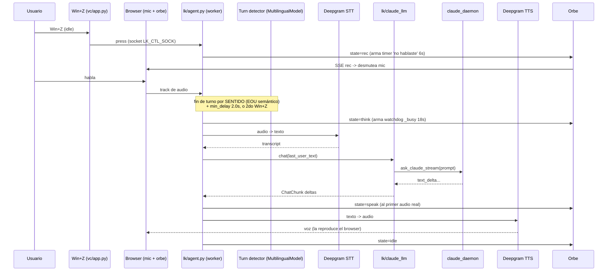

# Flujo de un turno

Un **turno** es una unidad completa de interacción: grabar → transcribir → Claude → hablar.
saga es **push-to-talk** con Win+Z, una máquina de 3 fases.

## Las 3 fases de Win+Z

| Fase | Estado | Win+Z hace |
|------|--------|------------|
| **idle** | nada corriendo, mic apagado | empieza a grabar (→ rec) |
| **rec** | grabando tu voz | corta y manda el turno ya (→ busy) |
| **busy** | transcribiendo / pensando / hablando | mata la respuesta en curso (→ idle) |

Además, en **rec** el turno también se cierra solo: lo decide el **turn detector
semántico** (no solo el silencio), sin segundo Win+Z. Ver abajo.

## Modo LiveKit / ROOM (default, Ciclo 4)

En **room** el worker (`lk/agent.py start`) está conectado a `livekit-server` y es
**headless**: el mic lo **publica el BROWSER** (cliente orbe). El track llega muteado y
se desmutea cuando el orbe entra en `rec` (vía SSE). En room el track detached descarta
frames → no hay backlog (esto resolvió el bug del buffer del modo console).

Detalle clave: el orbe pasa a `speak` **recién cuando el agente entra en `speaking`**
(primer audio real), no en el primer token de Claude (así queda en `think` mientras
Claude piensa o usa tools). El orbe **late con la voz real** que reproduce el browser.

### Fin de turno: turn detector semántico (no solo silencio)

El cierre automático del turno NO es VAD puro. La config vive en `turn_handling`
(`lk/agent.py`); los params top-level (`min_endpointing_delay`, `preemptive_generation`)
están **deprecados** y se ignoran cuando se pasa `turn_handling`:

- **`turn_detection: MultilingualModel()`** — modelo EOU multilingüe (soporta español).
  Decide si **terminaste de hablar por el SENTIDO de la frase**, no solo por el silencio.
  Anti-chopping: frases con pausas ya no se parten en varios turnos.
- **`endpointing: {min_delay: 2.0, max_delay: 6.0}`** — piso de silencio antes de cerrar.
  El `min_delay=2.0` da margen para seguir hablando entre sub-frases (modelo + 2s).
- **`interruption: {mode: "vad"}`** — interrupción/barge-in por VAD local (silero), NO
  "adaptive" (que requiere LiveKit Cloud key).
- **`preemptive_generation: {enabled: False}`** — **OFF a propósito**. Si está ON, el LLM
  arranca sobre transcripts **parciales** y se cancela/reintenta al seguir hablando. Con
  el LLM custom (bridge bloqueante al `claude_daemon`) eso causa **multi-commit → turnos
  partidos/cancelados sin respuesta**. El daemon caliente igual lo mantiene rápido.

### Timers y manejo de errores

- **Timer 'no hablaste' (6s)** — se ARMA al entrar en `rec` (`_arm_away`) y se CANCELA
  apenas el VAD detecta que empezaste a hablar (`user_state=speaking`) o cuando el turno
  arranca (`agent_state=thinking`). Si vence en `rec` sin que hayas hablado → vuelve a
  idle con orbe `error` (amarillo "no te entendí").
- **Watchdog `_busy` (18s)** — se ARMA al entrar a procesar (`thinking`). Si el turno
  queda colgado en `busy` sin llegar a hablar (LLM/daemon trabado, transcript que no
  llega) → destraba a idle con `error`. Se cancela al llegar a `speaking`.
- **Rapid Win+Z sin hablar** — cortar (`rec` → Win+Z) cuando el timer 'no hablaste' sigue
  armado significa turno VACÍO: no se manda nada, orbe `error` al toque (evita el cuelgue
  de comitear un turno sin transcript).
- **`thinking → listening` sin `speaking`** — NO muestra error: puede ser chopping (un
  turno nuevo canceló al viejo), no un turno vacío. Mostrar error ahí daba falsos
  positivos en frases con pausas; simplemente vuelve a idle.

### Estados del orbe

| Estado | Color | Cuándo |
|--------|-------|--------|
| `idle` | cian | quieto, mic apagado |
| `rec` | rojo | grabando tu voz |
| `think` | morado | STT terminó, Claude pensando |
| `speak` | verde | hablando (audio real) |
| `error` | amarillo | "no te entendí" (timeout/vacío) |
| `cancel` | rojo | Win+Z en busy mató la respuesta |

### Latencia (benchmark Ciclo 4, 104 turnos reales)

| Métrica | Mediana | Qué es |
|---------|---------|--------|
| LLM ttft | **2.2s** | el cerebro (`claude_daemon`) arranca a responder |
| TTS ttfb | **0.3s** | arranque de la voz |
| EOU delay | **2.0s** | espera tras dejar de hablar (= `min_delay` anti-chopping) |
| transcription_delay | 0.5s | STT (Deepgram) |

**Latencia percibida típica** (dejás de hablar → voz de saga) ≈ **4.5s** =
EOU 2.0 + ttft 2.2 + ttfb 0.3. El `min_delay=2.0` es una **decisión** (anti-chopping),
no una regresión; bajarlo acelera pero reintroduce chopping. Detalle en
`aidlc-docs/construction/build-and-test/ciclo4-build-and-test.md`.

## Modo CONSOLE (fallback dev)

`lk/agent.py console` corre el runtime de audio **local** (mic del proceso, sin server).
Tiene el bug conocido del buffer (Ciclo 3) y el wake server-side (`SAGA_WAKE_ENABLED=1`)
SOLO corre acá. En room el wake corre en el cliente (onnxruntime-web). BVC (noise
cancellation) también es solo console: en room requiere LiveKit Cloud.

## Modo clásico (fallback, `VOICE_LIVEKIT=0`)

Cada Win+Z corre un proceso efímero (`vc/app.py:_do_turn`):

1. `record_until_signaled()` — graba con auto-stop por VAD de voz (Silero).
2. `transcribe()` — daemon Whisper caliente (o fallback inline).
3. Chequeo de keywords: reset (`is_reset_command`) o visión (`is_visual_command`).
4. `ask_claude_stream()` — cerebro (daemon o one-shot).
5. `stream_to_sentences()` + `TTSStreamer` — microchunking → edge-tts → mpg123.

Estados de retorno de `_do_turn`: `ok` · `cancel` · `short` · `empty` · `reset` · `error`.

## Comandos de voz y variantes

El turn handler del modo default es `lk/claude_llm.py` (reusa helpers de `vc/`):

- **Reset de sesión**: "nueva sesión", "empezamos de cero"… → `reset_claude()` (el daemon
  respawnea), orbe `nueva`, confirmación hablada sin mandar la consigna a Claude
  (keywords en `vc/config.RESET_KEYWORDS`).
- **Visión on-demand**: "mirá la pantalla", "qué ves"… → captura con `grim`, se adjunta a
  Claude como `screenshot_path`, y se **borra** tras mandarla (keywords en `VISUAL_RE`).
- **Adjuntos del panel del orbe**:
  - *Texto* (autosave del textarea) → se stagea en MEMORIA del agente (`stage` →
    `take_staged()` lo consume en el turno), NO en filesystem.
  - *Imagen* pegada → dead-drop en `/tmp` (la lee Claude como screenshot); tiene
    prioridad sobre "mirá pantalla".
  - Se consumen en el próximo turno (consume-once).
- **Prompt por texto (Shift+Enter)** en el panel → `say` → `session.generate_reply(
  user_input=text)`: turno inmediato SIN grabar voz, mismo LLM + TTS. El agente hace
  `clear_text()` antes (anti doble-consumo).

## Cancelación / barge-in

- Modo room/console: Win+Z en `busy` → `session.interrupt(force=True)` corta TTS + cancela
  el LLM, y `clear_user_turn()` + mic off (sin zombie). Orbe `cancel`. Barge-in por voz =
  VAD local (silero, `interruption.mode="vad"`). En `claude_llm`, si LiveKit cancela el
  turno, setea el flag global `_cancel` que corta el generador del daemon.
- Modo clásico: `SIGUSR2` → setea el evento global `_cancel`, mata el proceso `claude` y el
  streamer TTS.

Para los contratos de socket que disparan todo esto, ver `internal-api.md`.
