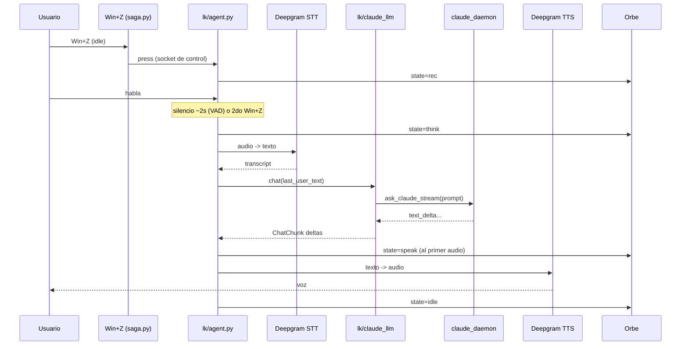

# Flujo de un turno

Un **turno** es una unidad completa de interacción: grabar → transcribir → Claude → hablar.
saga es **push-to-talk** con Win+Z, una máquina de 3 fases.

## Las 3 fases de Win+Z

| Fase | Estado | Win+Z hace |
|------|--------|------------|
| **idle** | nada corriendo, mic apagado | empieza a grabar (→ rec) |
| **rec** | grabando tu voz | corta y manda el turno ya (→ busy) |
| **busy** | transcribiendo / pensando / hablando | mata la respuesta en curso (→ idle) |

Además, en **rec** el turno también se cierra solo por **silencio** (~2s de VAD), sin segundo Win+Z.

## Modo LiveKit (default)

Detalle clave: el orbe pasa a `speak` **recién cuando sale el primer audio real** por el parlante,
no en el primer token de Claude (así queda en `think` mientras Claude piensa o usa tools).

## Modo clásico (fallback, `VOICE_LIVEKIT=0`)

Cada Win+Z corre un proceso efímero (`saga.py` → `vc/app.py:_do_turn`):

1. `record_until_signaled()` — graba con auto-stop por VAD de voz (Silero).
2. `transcribe()` — daemon Whisper caliente (o fallback inline).
3. Chequeo de keywords: reset (`is_reset_command`) o visión (`is_visual_command`).
4. `ask_claude_stream()` — cerebro (daemon o one-shot).
5. `stream_to_sentences()` + `TTSStreamer` — microchunking → edge-tts → mpg123.

Estados de retorno de `_do_turn`: `ok` · `cancel` · `short` · `empty` · `reset` · `error`.

## Comandos de voz y variantes

- **Reset de sesión**: "nueva sesión", "empezamos de cero"… → respawn limpio de Claude
  (keywords en `vc/config.RESET_KEYWORDS`).
- **Visión on-demand**: "mirá la pantalla", "qué ves"… → captura con `grim`, se adjunta a Claude,
  y se **borra** (keywords en `VISUAL_RE`).
- **Adjuntos del panel del orbe**:
  - *Texto* (autosave del textarea) → se stagea en memoria del agente (`stage`).
  - *Imagen* pegada → dead-drop en `/tmp` (la lee Claude como screenshot).
  - Se consumen en el próximo turno (consume-once).
- **Prompt por texto (Shift+Enter)** en el panel → dispara un turno inmediato sin grabar voz
  (`say`), mismo LLM + TTS.

## Cancelación / barge-in

- Modo LiveKit: Win+Z en `busy` → `session.interrupt(force=True)` corta TTS + cancela el LLM.
- Modo clásico: `SIGUSR2` → setea el evento global `_cancel`, mata el proceso `claude` y el streamer TTS.

Para los contratos de socket que disparan todo esto, ver `internal-api.md`.
