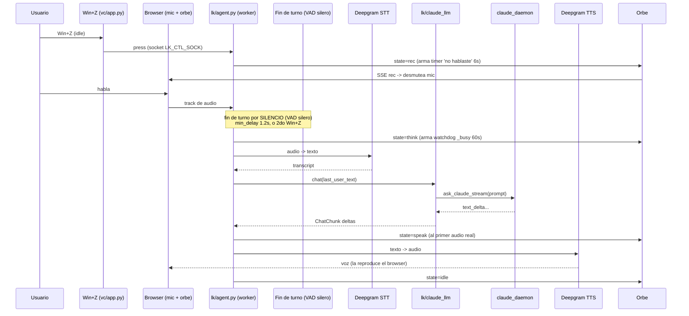

# Flujo de un turno

Un **turno** es una unidad completa de interacción: grabar → transcribir → Claude → hablar.
saga tiene **dos modos de turno**, que ramifican en `_turn_handling()` (`lk/agent.py`).

## Modo push-to-talk (`SAGA_MODE=ptt`, default): 3 fases de Win+Z

| Fase | Estado | Win+Z hace |
|------|--------|------------|
| **idle** | nada corriendo, mic apagado | empieza a grabar (→ rec) |
| **rec** | grabando tu voz | corta y manda el turno ya (→ busy) |
| **busy** | transcribiendo / pensando / hablando | mata la respuesta en curso (→ idle) |

El turno cierra por **silencio**: `turn_detection="vad"` (silero) con `endpointing.min_delay=1.2s`.
Ese piso se paga entero en CADA turno, aunque la frase esté obviamente terminada — era el 54% de la
latencia percibida (3.0s de 5.6s medidos) cuando estaba en 3.0s.

## Modo llamada (`SAGA_MODE=call`): una línea abierta

No hay "grabar un turno". Win+Z **levanta el tubo** y la línea queda abierta:

| Fase | Estado | Win+Z hace |
|------|--------|------------|
| **idle** | colgado, mic apagado | abre la línea (→ call) |
| **call** | línea abierta; los turnos van y vienen | **cuelga** (→ idle) |

Lo que lo distingue de push-to-talk es que **la fase nunca vuelve a `idle` entre turnos**: el mic no
se apaga y no hay que apretar nada de nuevo. El fin de cada turno lo decide **Flux**
(`turn_detection="stt"`), con señales acústicas Y lingüísticas — corta en ~0.5s cuando la frase cerró
y se toma hasta ~1.4s cuando queda ambigua, que es lo que un umbral fijo no puede hacer.

La línea **cuelga sola** tras `SAGA_CALL_IDLE_TIMEOUT_S` (180s) sin actividad. Es a propósito: un mic
abierto indefinidamente frente a una IA agéntica con permisos `auto` es una superficie que no
queremos dejar viva sin que nadie la esté usando.

Además, en **rec** el turno también se cierra solo **por silencio** (VAD silero,
~1.2s), sin segundo Win+Z. Ver abajo. (Antes era un turn detector SEMÁNTICO
`MultilingualModel`; U10 lo reemplazó por VAD puro y liberó ~1.8 GB de RAM.)

## Modo room (único, Ciclo 4)

El worker (`lk/agent.py start`) está conectado a `livekit-server` y es
**headless**: el mic lo **publica el BROWSER** (cliente orbe). El track llega muteado y
se desmutea cuando el orbe entra en `rec` (vía SSE). El track detached descarta
frames cuando el mic está apagado → no hay backlog de audio.

Detalle clave: el orbe pasa a `speak` **recién cuando el agente entra en `speaking`**
(primer audio real), no en el primer token de Claude (así queda en `think` mientras
Claude piensa o usa tools). El orbe **late con la voz real** que reproduce el browser.

### Turno SEGMENTADO (bloques)

Un turno de Claude Code **no es un stream continuo**: es `texto → hueco de tools (100s+)
→ texto → hueco → texto`. Modelarlo como un solo `llm.LLMStream` rompía la voz:

> El plugin de Deepgram hace `ws.receive(timeout=conn_options.timeout)` (default **10s**).
> Durante el hueco no llega texto, el websocket muere con `APITimeoutError`, LiveKit ve
> *"TTS failed after partial audio was already sent to the user, skip retrying"* y la
> respuesta final llega a un canal muerto. El orbe quedaba en `speak` sin voz.

Hoy el turno se parte en **bloques**, usando el `stop_reason=tool_use` del stream-json:

| Evento del CLI | `Ev` | Qué hace |
|---|---|---|
| `content_block_delta` / `text_delta` | `text` | va al TTS (hablable) |
| `content_block_start` / `tool_use` | `tool` | log + orbe (no se habla) |
| `message_delta` / `stop_reason=tool_use` | `break` | **cierra el bloque de voz** |

- El **primer bloque** sale por el pipeline normal: `lk/claude_llm.py` cierra el
  `LLMStream` en el `break` → LiveKit sintetiza y cierra el websocket **limpio**.
- Los **bloques siguientes** los habla `lk/speech.py` con `session.say()` (primitiva
  nativa de LiveKit; no sintetizamos audio nosotros). Cada uno abre y cierra su propio
  websocket.
- Durante el hueco **no hay ningún websocket abierto** → el timeout es imposible, y el
  orbe muestra `think` en vez de simular que habla.
- Los bloques `thinking` emiten `thinking_delta`, no `text_delta` → el razonamiento
  interno nunca llega al TTS.

**Concurrencia** (`lk/speech.py`): el turno sobrevive al stream del LLM, así que dos
turnos se pueden solapar. Cada turno se numera (`new_turn()`) y solo el de número más
alto es el vigente; un turno viejo no mueve el orbe ni toca estado global (su `finally`
corre *después* del cancel y si no apagaría al nuevo). La cancelación corta las dos
puntas: el task async y el thread bloqueado en el socket del daemon, vía un
`threading.Event` **por turno** — el `vc.runtime._cancel` global mataba también al turno
nuevo. El drenado es dueño del thread: siempre lo corta y lo espera antes de salir.

Como red de seguridad queda `tts_conn_options=APIConnectOptions(timeout=30.0)` en la
`AgentSession`: cubre un bloque lento sin enmascarar un cuelgue real.

### Fin de turno: VAD puro (cierre por silencio)

El cierre automático del turno es **VAD puro** (silero): el turno cierra por SILENCIO.
La config vive en `turn_handling` (`lk/agent.py`); los params top-level
(`min_endpointing_delay`, `preemptive_generation`) están **deprecados** y se ignoran
cuando se pasa `turn_handling`:

- **`turn_detection: "vad"`** — fin de turno por el VAD silero (`activation_threshold 0.7`,
  el mismo que ya estaba cargado). El turno cierra cuando dejás de hablar el tiempo de
  silencio configurado. (Antes era un modelo EOU SEMÁNTICO `MultilingualModel` que decidía
  el fin por el SENTIDO de la frase; U10 lo reemplazó por VAD puro → liberó ~1.8 GB de RAM
  y eliminó el error "Error predicting end of turn". La UX del turno se mantuvo: en la
  práctica el cierre ya se daba por silencio.)
- **`endpointing: {min_delay: 1.2, max_delay: 6.0}`** — piso de silencio antes de cerrar.
  El `min_delay=1.2` se paga ENTERO en cada turno (era 3.0 = 54% de la latencia percibida). Si te corta frases a la mitad, subilo a 1.8.
- **`interruption: {mode: "vad"}`** — interrupción/barge-in por VAD local (silero), NO
  "adaptive" (que requiere LiveKit Cloud key).
- **`preemptive_generation: {enabled: False}`** — **OFF a propósito**. Si está ON, el LLM
  arranca sobre transcripts **parciales** y se cancela/reintenta al seguir hablando. Con
  el LLM custom (bridge bloqueante al `claude_daemon`) eso causa **multi-commit → turnos
  partidos/cancelados sin respuesta**. El daemon caliente igual lo mantiene rápido.

### Timers y manejo de errores

- **Timer 'no hablaste' (6s)** — se ARMA al entrar en `rec` (`_arm_away`) y se CANCELA
  apenas el VAD detecta que empezaste a hablar (`user_state=speaking`) o cuando el turno
  arranca (`agent_state=thinking`). Si vence en `rec` sin que hayas hablado → vuelve a
  idle con orbe `error` (amarillo "no te entendí").
- **Watchdog `_busy` (60s)** — se ARMA al entrar a procesar (`thinking`). Si el turno
  queda colgado en `busy` sin llegar a hablar (LLM/daemon trabado, transcript que no
  llega) → destraba a idle con `error`. Se cancela al llegar a `speaking`. (Era 18s; subido
  en Ciclo 5: con tool/MCP los turnos tardan 13-17s+ y 18s los mataba en falso. Es red de
  seguridad para cuelgues REALES, no presupuesto de latencia.)
- **Rapid Win+Z sin hablar** — cortar (`rec` → Win+Z) cuando el timer 'no hablaste' sigue
  armado significa turno VACÍO: no se manda nada, orbe `error` al toque (evita el cuelgue
  de comitear un turno sin transcript).
- **`thinking → listening` sin `speaking`** — NO muestra error: puede ser chopping (un
  turno nuevo canceló al viejo), no un turno vacío. Mostrar error ahí daba falsos
  positivos en frases con pausas; simplemente vuelve a idle.

### Estados del orbe

| Estado | Color | Cuándo |
|--------|-------|--------|
| `idle` | cian | quieto, mic apagado |
| `rec` | rojo | grabando tu voz |
| `think` | morado | STT terminó, Claude pensando |
| `speak` | verde | hablando (audio real) |
| `error` | amarillo | "no te entendí" (timeout/vacío) |
| `cancel` | rojo | Win+Z en busy mató la respuesta |

### Latencia (benchmark Ciclo 4, 104 turnos reales)

| Métrica | Mediana | Qué es |
|---------|---------|--------|
| LLM ttft | **2.2s** | el cerebro (`claude_daemon`) arranca a responder |
| TTS ttfb | **0.3s** | arranque de la voz |
| EOU delay | **1.2s** | espera tras dejar de hablar (= `min_delay`; el benchmark Ciclo 4 midió 2.0, U10 lo subió a 3.0, hoy 1.2) |
| transcription_delay | 0.5s | STT (Deepgram) |

**Latencia percibida típica** (dejás de hablar → voz de saga): con `min_delay=1.2`
≈ **3.7s** = EOU 1.2 + ttft 2.2 + ttfb 0.3 (con el 3.0 de U10 era ≈5.5s). El `min_delay` es
una **decisión**: bajarlo acelera TODOS los turnos pero puede reintroducir chopping (te corta
entre sub-frases). Si pasa, subilo a 1.8 antes que volver a 3.0.

En turnos con **visión** la ganancia es mayor: la imagen desviaba el turno al one-shot
(`ttft=7.1s` medido, contra 2.1s del daemon caliente) y además bifurcaba el contexto. Hoy la
imagen va por el daemon.

## Wake word

El wake "hey saga" es **opt-in** (`SAGA_WAKE_ENABLED=1`) y corre server-side en el agente.
Por default el trigger es Win+Z. BVC (noise cancellation) NO se usa: requiere LiveKit Cloud;
room se apoya en el VAD Silero.

## Comandos de voz y variantes

El turn handler es `lk/claude_llm.py` (reusa helpers de `vc/`):

- **Reset de sesión**: "nueva sesión", "empezamos de cero"… → `reset_claude()` (el daemon
  respawnea), orbe `nueva`, confirmación hablada sin mandar la consigna a Claude
  (keywords en `vc/config.RESET_KEYWORDS`).
- **Visión on-demand**: "mirá la pantalla", "qué ves"… → captura con `grim`, se adjunta a
  Claude como `screenshot_path`, y se **borra** tras mandarla (keywords en `VISUAL_RE`).
- **Adjuntos del panel del orbe**:
  - *Texto* (autosave del textarea) → se stagea en MEMORIA del agente (`stage` →
    `take_staged()` lo consume en el turno), NO en filesystem.
  - *Imagen* pegada → dead-drop en `/tmp` (la lee Claude como screenshot); tiene
    prioridad sobre "mirá pantalla".
  - Se consumen en el próximo turno (consume-once).
- **Prompt por texto (Shift+Enter)** en el panel → `say` → `session.generate_reply(
  user_input=text)`: turno inmediato SIN grabar voz, mismo LLM + TTS. El agente hace
  `clear_text()` antes (anti doble-consumo).

## Cancelación / barge-in

Win+Z en `busy` → `session.interrupt(force=True)` corta TTS + cancela
el LLM, y `clear_user_turn()` + mic off (sin zombie). Orbe `cancel`. Barge-in por voz =
VAD local (silero, `interruption.mode="vad"`). En `claude_llm`, si LiveKit cancela el
turno, setea el flag global `_cancel` que corta el generador del daemon.

**Filtros para no cortarse con cualquier ruido.** El modo `adaptive` de LiveKit —el detector ML que
distingue un "ajá" de un corte real— necesita LiveKit Cloud, así que acá quedan dos parámetros
locales del framework:

- `min_words=2` — palabras mínimas. **Con el default de LiveKit (0), una sola palabra mal
  transcripta cortaba una respuesta de 20 segundos.** Medido el 21/8: un `'Aquello'` cortó la
  historia del Imperio romano, y como cada corte respawnea el proceso de Claude, la misma anécdota
  se contó cuatro veces sin avanzar nunca.
- `min_duration=0.5` — voz mínima sostenida. Es el piso que explica los `end_of_utterance_delay`
  clavados en 0.500s del log: no era Flux decidiendo, era este umbral.
- `resume_false_interruption` + `false_interruption_timeout=1.5` — si el VAD creyó que la cortaste
  pero no dijiste nada, retoma donde iba en vez de comerse la respuesta.

### Qué llegaste a escuchar (`lk/heard.py`)

Al interrumpir hay **dos memorias que no coinciden**: LiveKit trunca el mensaje del asistente a lo
que sonó de verdad (`content=[forwarded_text]`, `interrupted=True`), y la sesión de Claude guarda lo
que **generó**, que es todo. Como `claude_llm` ignora el `chat_ctx` a propósito, esa verdad no
llegaba al cerebro: le pedías "repetime lo último" y repetía desde el texto completo.

`heard.py` lee ese texto ya truncado por el framework y lo pasa como nota de sistema al próximo
prompt, consume-once. **No reimplementa la truncación**: la transporta por el hueco que abre nuestra
propia arquitectura. Es el peaje de que el contexto sea de Claude y no de LiveKit
(ver [`architecture.md`](architecture.md)).

> **Gotcha**: esa nota cita a Claude, así que **no puede alimentar detectores**. El de visión corría
> sobre el prompt ya compuesto y, contando sobre "San Nicolás de **Mira**", disparó tres capturas de
> pantalla seguidas (1.4 MB) en turnos donde nadie pidió nada visual. Hoy corre sobre `pedido` (lo
> que dijo el usuario), nunca sobre `prompt`.

Para los contratos de socket que disparan todo esto, ver `internal-api.md`.
